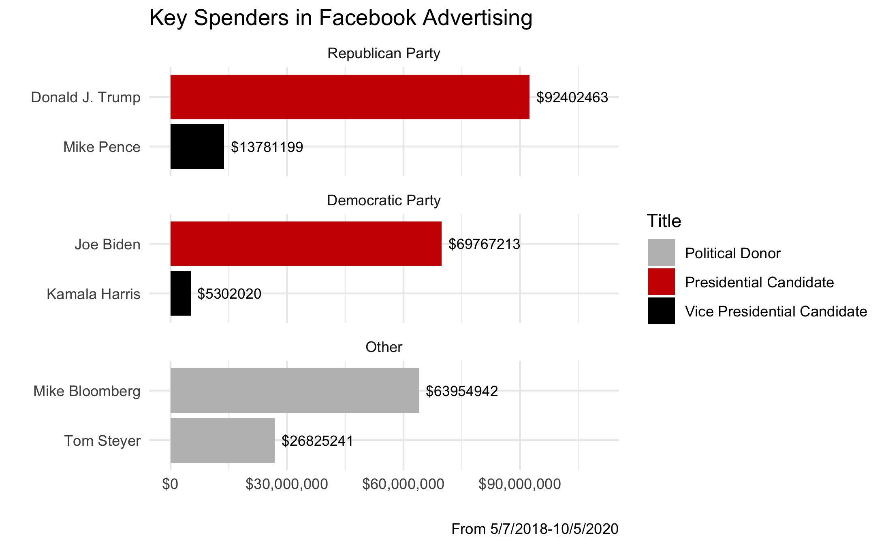
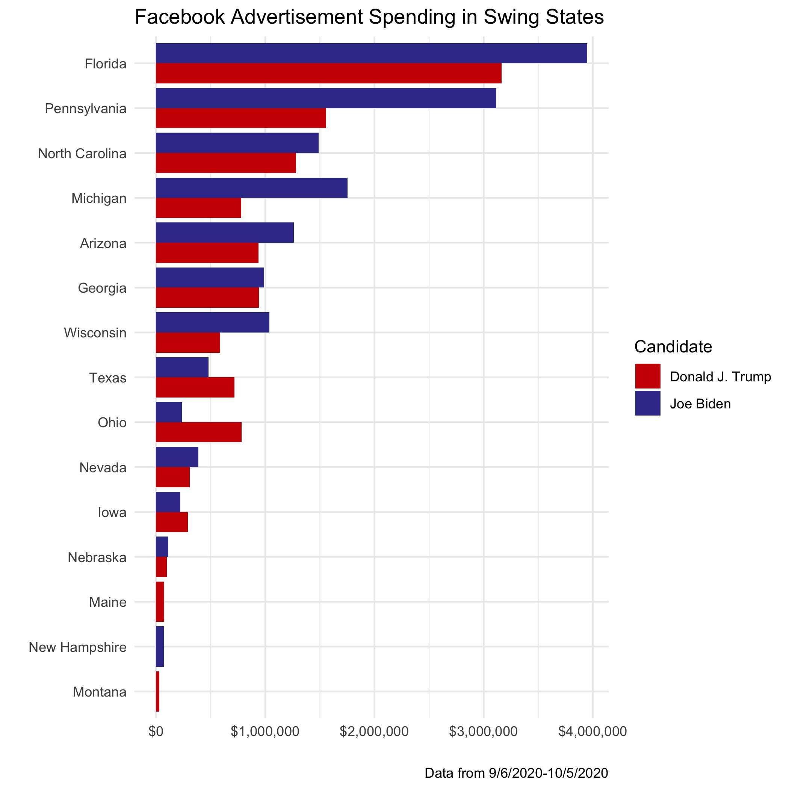
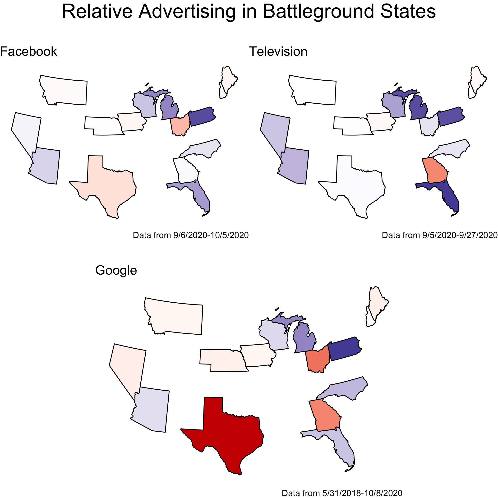
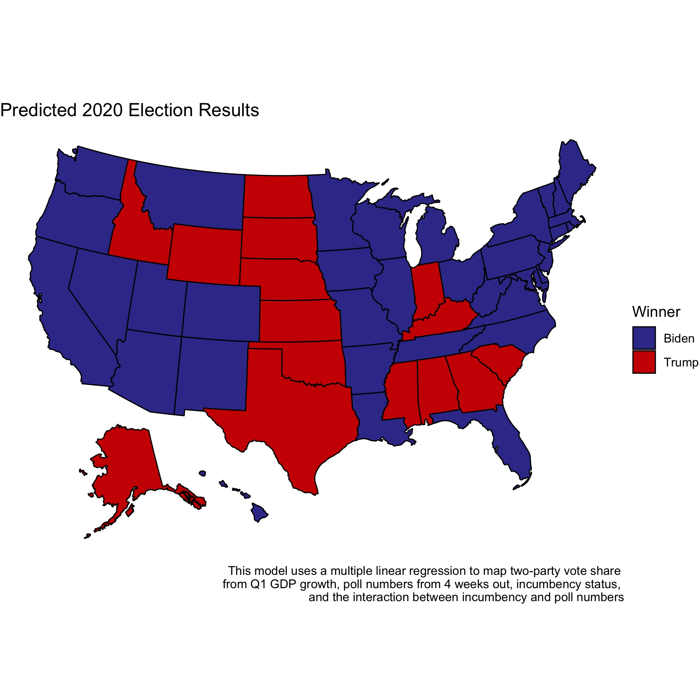

# Incumbency and Elections
## October 3, 2020

### Role of Advertising in Political Campaigns

Political advertisements have powerful but short-lived effects.[^gerber] The time sensitivity of advertising effects makes advertisements closer to the election all the more important. With the 2020 election less than a month away, it may be worthwhile to examine the advertising patterns of the two major-party candidates. The current structure of the Electoral College places the outcome of the election in the hands of a handful of states. Due to the time-sensitive nature of the effects of advertising and the importance of these few states, this analysis will focus on the political advertising in the past month within battleground states.[^battleground]

### Overview of Television Ads over the Years

Political [spending](https://mediaproject.wesleyan.edu/dataaccess/) on TV advertising has steadily increased over the years, with the same pattern of Democrats outspending Republicans in the year preceding the election and Republicans outspending Democrats in election years:

- tone
- sheer number
- 2020 volume by state

### Social Media and Internet Advertising in Campaigns

Allegations of Russian interference in the 2016 election put social media at the forefront of the political stage. Russia did not alter any actual votes, but they did [spread propaganda](https://time.com/5565991/russia-influence-2016-election/) on social media. Did social media have enough power to actually change the 2016 outcome? Or do people choose to only believe or consume content that reinforces their existing beliefs? The answers to these questions lie beyond the scope of this blog post; however, it does appear that candidates themselves devote sizable sums of money to advertising on Internet platforms such as Facebook and Google.

#### Facebook Advertising in 2020

The [Facebook Ad Library](https://www.facebook.com/ads/library/?active_status=all&ad_type=political_and_issue_ads&country=US) contains data for advertisements about social issues, elections, and politics. While Donald Trump undoubtedly prefers to use his [Twitter](https://twitter.com/realDonaldTrump?ref_src=twsrc%5Egoogle%7Ctwcamp%5Eserp%7Ctwgr%5Eauthor) as his primary means of communication with the American people, he does not shy away from pouring sizable sums of money into advertising on Facebook:

Not surprisingly, the major party candidates top out the list, with their running mates trailing behind. One aspect of the [incumbent advantage](../posts/incumbency.md) is that Donald Trump began his campaign far earlier than Biden, and the greater spending on advertisements over the past two years is one manifestation of that. Interestingly, two key players both paid more for Facebook ads in the past 30 days than the vice presidential candidates: Mike Bloomberg and Tom Steyer. Mike Bloomberg famously spent [over $1 billion](https://abcnews.go.com/Politics/mike-bloomberg-spent-billion-month-presidential-campaign-filing/story?id=70252435) in his four-month bid for the Democratic primary, and he continues to direct some of his fortune to help further the [Democratic cause](https://abcnews.go.com/Politics/mike-bloomberg-spent-billion-month-presidential-campaign-filing/story?id=70252435). Tom Steyer, another [contender](https://www.npr.org/2020/02/29/801952931/tom-steyer-to-drop-out-of-2020-presidential-race) in the Democratic primary, has also made massive investments in Facebook advertisements over the course of the past couple of years.

While Trump has invested the most money in Facebook advertisements over the past two years, Joe Biden has outspent Donald Trump in a number of key swing states over the course of the past month:

Since research supports that the effects of political advertising diminish quickly,[^gerber] Biden's strategic spending in swing states on the tail-end of the campaign may very likely work to his advantage more than if he had spread that spending across the country over the course of the campaign.

#### Google Advertising in 2020

Google's [Transparency Report](https://transparencyreport.google.com/political-ads/region/US) provides data pertaining to political advertising on Google, YouTube, and other partner properties. The below figure compares the relative advertising[^relative] numbers on Facebook, TV, and Google[^google-data] across battleground states. Blue indicates either greater ad volume or spending by Joe Biden, and red indicates greater advertising volume or spending by Donald Trump:

The candidates appear to be devoting proportional amounts of attention to the respective states across the platforms, with Ohio, Nevada, and Georgia as the only states that really vary in partisan attention across platforms. Also, Donald Trump appears to be devoting much more attention than Biden to Google advertisements in Texas relative to other platforms. On the other hand, Biden appears to be devoting much more relative attention to TV ads in Florida than on other platforms. 

### What does this mean?

While political advertising does little to inform and mobilize voters, they do have persuasive effects.[^huber] What could the candidates in 2020 hope to gain from their advertising initiatives? If Michael Bloomberg's campaign is any example, advertising alone is unlikely to be enough to change the course of an election. 

Also, most previous studies examine the possible effects of television advertising, and, as we see in the data, many candidates have devoted large sums of money to online advertising in recent years. Do online advertisements have the same effect? Or, perhaps, are they less salient due to the ability to scroll immediately past them?

My most successful model[^model] thus far has not used advertising as a predictor. To visualize how the predictions of this model differ from the candidates' relative ad strategies, I created a model[^improve] using those variables for each state and predicted the winner of the two-party popular vote, with the following results:  

Most states appear to match the color of the maps on relative ad spending in swing states, indicating that candidates may not be aiming to flip states that are out of reach, but instead maintain narrow projected leads.

[^gerber]: [Gerber et al., 2011] Gerber, A. S., Gimpel, J. G., Green, D. P., and Shaw, D. R. (2011). How Large and Long-lasting are the Persuasive Effects of Televised Campaign Ads? Results from a Randomized Field Experiment.American Political Science Review, 105(01):135–150.

[^battleground]: While I previously constructed my personal definition of [battleground states](../posts/intro.md), this analysis focuses on the states that the [New York Times](https://www.nytimes.com/interactive/2020/us/elections/election-states-biden-trump.html) classifies as competitive in this interactive model for the 2020 election.

[^relative]: These maps are generated by taking the difference between Joe Biden's ad spending or count and Donald Trump's ad spending or count. The different platforms offered different metrics in the data, which is why I could not use either just spending or just counts across the board. However, both measure the attention devoted to each state by each candidate, and I used the same metric for both candidates on each map, so it does not weaken the descriptive power of the map. 

[^google-data]: Google's data begins on 5/31/2018 and did not have dates as a variable in the dataset, so it is important to consider that the Google map does not isolate how candidates have allocated their advertising efforts in the past month.

[^huber]: [Huber and Arceneaux, 2007] Huber, G. A. and Arceneaux, K. (2007).Identifying the Persuasive Effects of Presidential Advertising.American Journal of Political Science,51(4):957–977.

[^model]: Variants of this model are featured as Model 3 in the [Economy](economy.md) post, my regression in the [Polling](polling.md) post, and my regression in the [Incumbency](incumbency.md) post.

[^improve]: In the coming weeks, I hope to improve this model by accounting for more variation and converting it to a probabilistic model. Currently, the two-party vote sums for each candidate do not sum exactly to 100% for each state. This does not pose any major problems for the purposes of this simple visualization. However, I would like to fix that before I make any electoral predictions using these state-by-state models. By the election, I would also like incorporate uncertainty by simulating the election a large number of times and predicting each state's winner from those simulations.
