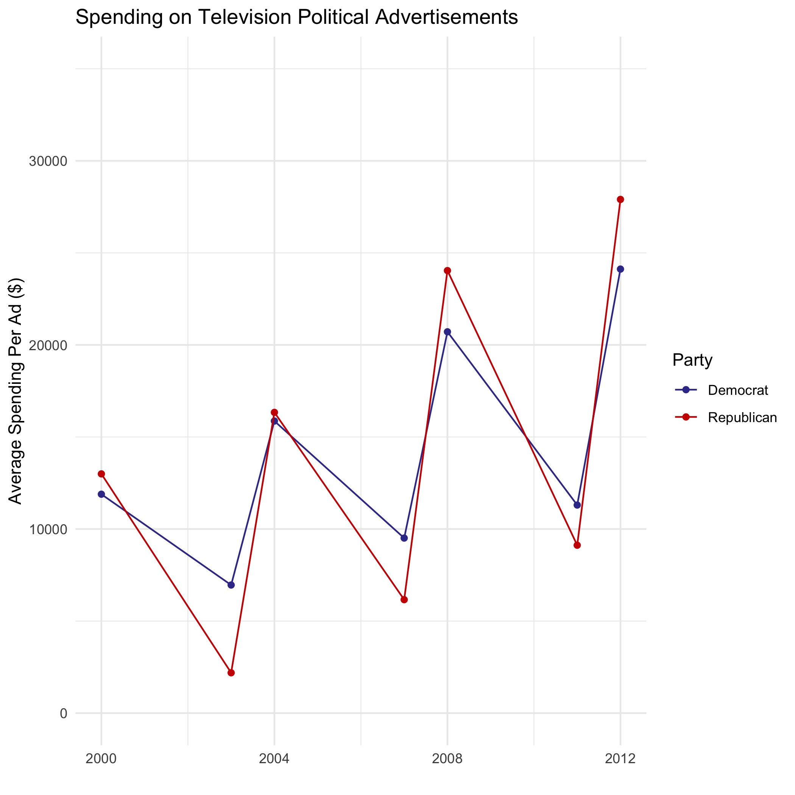

# Incumbency and Elections
## October 3, 2020

### Role of Advertising in Political Campaigns

Political advertisements have powerful but short-lived effects.[^gerber] The time sensitivity of advertising effects makes advertisements closer to the election all the more important. With the 2020 election less than a month away, it may be worthwhile to examine the advertising patterns of the two major-party candidates.

### Overview of Television Ads over the Years

Political spending on TV advertising has steadily increased over the years, with the same pattern of Democrats outspending Republicans in the year preceding the election and Republicans outspending Democrats in election years:

https://mediaproject.wesleyan.edu/dataaccess/

- tone
- sheer number
- 2020 volume by state

### Social Media and Internet Advertising in Campaigns

Allegations of Russian interference in the 2016 election put social media on the forefront of the political stage. Russia did not alter any actual votes, but they did [spread propaganda](https://time.com/5565991/russia-influence-2016-election/) on social media. Did social media have enough power to actually change the 2016 outcome? Or do people choose to only believe or consume content that reinforces their existing beliefs? The answers to these questions lie beyond the scope of this blog post; however, it does appear that candidates themselves devote sizable sums of money to advertising on Internet platforms such as Facebook and Google.

### Facebook Advertising in 2020

Data from the [Facebook Ad Library](https://www.facebook.com/ads/library/?active_status=all&ad_type=political_and_issue_ads&country=US)

- comparing top spenders
- broken spending broken down by state

### Google Advertising in 2020

Google's [Transparency Report](https://transparencyreport.google.com/political-ads/region/US) provides data pertaining to political advertising on Google, YouTube, and other partner properties. 

### What does this mean?

While political advertising does little to inform and mobilize voters, they do have persuasive effects.[^huber] What could the candidates in 2020 hope to gain from their advertising initiatives?

- ads may be less salient on the Internet due to greater volume (easier to scroll past or tune out)
- Michael Bloomberg still lost

Can compare advertising frequency to model predictions
compare ads to Google trends for states

[^gerber]: [Gerber et al., 2011] Gerber, A. S., Gimpel, J. G., Green, D. P., and Shaw, D. R. (2011).HowLarge and Long-lasting are the Persuasive Effects of Televised Campaign Ads? Resultsfrom a Randomized Field Experiment.American Political Science Review, 105(01):135–150.

[^huber]: [Huber and Arceneaux, 2007] Huber, G. A. and Arceneaux, K. (2007).Identifying thePersuasive Effects of Presidential Advertising.American Journal of Political Science,51(4):957–977.
