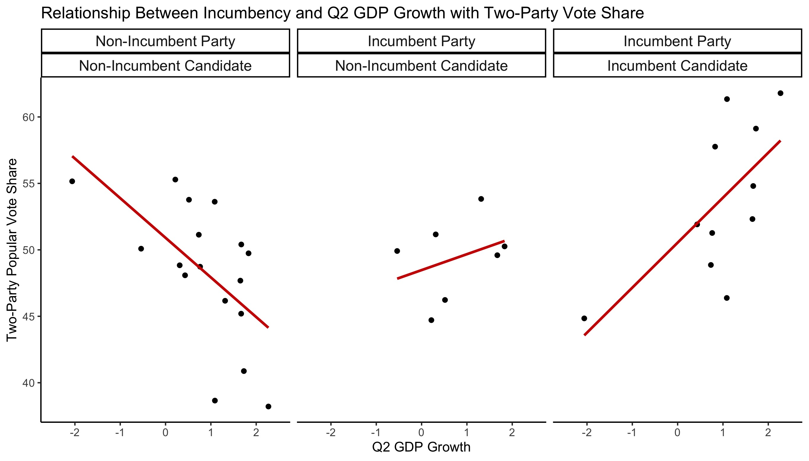
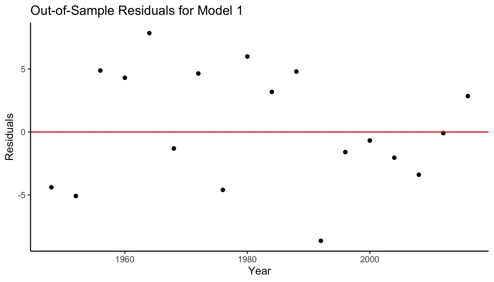
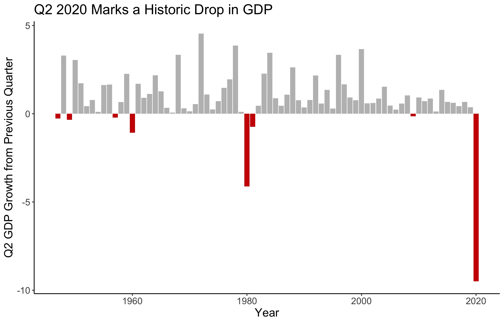

# Introduction: The Economy's Role in Elections
## September 19, 2020

#### Overview

Research suggests that voters tend to reward incumbents for short-term economic conditions, typically within 6 months to 1 year from election day.[^1] 

### Model 1 : Incumbency Status and Q2 GDP Growth

While the literature suggests that voters reward the incumbent party for short-term economic conditions, how does this vary among sitting presidents seeking re-election and same-party heirs seeking the office? The below plot indicates that the relationship between Q2 GDP Growth and two-party vote share does differ depending on incumbency status:

An [exploratory analysis](../figures/economy.ggpairs.jpeg) of the economic variables in the [data](../data/econ.csv)[^2] revealed that Q2 GDP growth has the highest correlation with two-party vote share for the incumbent party. After testing numerous variables with an interaction term for incumbency status, the strongest model that observed the interaction between incumbency and an economic variable examined the interaction between election-year Q2 GDP growth and incumbency status of candidates in the incumbent party. While the [regression](../figures/inc_gdp_reg.html) does not reveal a significant relationship between the interaction of incumbency status with GDP growth, it does detect that on average, an incumbent candidate's two-party vote share increases by approximately 2.2 percentage points for every percentage increase in Q2 GDP growth.

To test the out-of-sample fit for this model, I performed leave-one-out cross validation for each post-WWII election. The below plot displays no clear pattern in the residuals, with the model predicting most elections within 5 percentage points:

After building the model and assessing the out-of-sample fit, I put the model to the test with 2020 data. While Q2 numbers typically serve as a good indicator for voting patterns in election years, the COVID-19 pandemic brought historic lows for the US economy. While incumbency status typically boosts vote share, this simple model based on the economy did do much in the way of helping out Trump and predicted that he would only win approximately **18.4%** of the popular vote.

### Model 2: Incumbency Status, Q2 GDP Growth, and Job Approval

While some people feel frustrated about Donald Trump's performance, no one realistically expect him to only win 18% of the popular vote. Focusing a model solely on economics limits the scope gives undue weight to the economic disaster of 2020. Through the economic storm in the past few months, however, President Trump's economic approval rating has remained relatively [stable](https://www.nytimes.com/2020/08/24/us/politics/trump-economy.html). In order to account for this gap between public opinion and economic data, I added Q3 job approval as an additional variable for Model 2. I chose election-year Q3 job approval in particular because voters assign greater weight to performance at the end of the president's term[^1], and the [job approval dataset](https://www.presidency.ucsb.edu/statistics/data/presidential-job-approval) had Q3 2020 numbers available for Donald Trump.

The [regression](../figures/economy/inc_gdp_approval.html) mapping the incumbent party's popular vote by the interaction between Q2 GDP growth and presidential job approval does not reveal a significant relationship between vote share and the interactions between incumbency status and GDP or approval. However, Q3 job approval does have a statistically significant relationship with two-party vote share; on average, every single point increase in job approval accompanies an approximate increase of 0.183 percent in the popular vote.

After performing leave-out-one cross-validation for every post-WWII election, the out-of-sample residuals for the popular vote estimates mostly lie within 3 percentage points and do not show any distinct pattern in the [residual plot](../figures/economy/inc_gdp_approval_resid.jpg). When predicting Donald Trump's two-party popular vote share for 2020 using his incumbency status, Q2 GDP growth, and Q3 job approval ratings, Model 2 estimates that he will receive approximately **38.5%** of the popular vote.

### Model 3

While Model 2 yields a slightly more realistic prediction, it still seems a bit out of touch with reality, largely due to the massive drop in Q2 GDP. To amend that, I revised Model 3 to replace Q2 GDP with Q1 GDP. This substitution still accounts for the impact of COVID-19 on Trump's presidential bid, but it does not restrict the model to the worst economic quarter of Trump's presidency.

The [regression](../figures/economy/inc_q1_gdp_approval.html) for Model 3 yields significant variables of Q3 jobs approval, incumbency status, the interaction between incumbency and Q1 GDP growth, and the interaction between incumbency and Q3 job approval. This shows that the Q1 GDP growth and Q3 job approval are associated with a greater share of the two-party popular vote for sitting presidents compared to new candidates of the incumbent party

Model 3's leave-out-one cross validation shows uniformly scattered [residuals](../figures/economy/inc_q1_gdp_approval_resid.jpg) and predicts that Donald Trump will earn approximately **42.5%** of the two-party popular vote.

### Model Comparison

### Limitations

By mid-March, COVID-19 had reached all [50 states](https://www.cdc.gov/mmwr/volumes/69/wr/mm6915e4.htm). While Q2 economic numbers ordinarily serve as good predictors for presidential elections, real GDP decreased at an annual rate of [32.9%](https://www.bea.gov/news/2020/gross-domestic-product-2nd-quarter-2020-advance-estimate-and-annual-update) in the second quarter. Q3 numbers might lend themselves to slightly more realistic models, but those numbers are not available yet. The below visualization, which replicates a similar graphic from the [New York Times](https://www.nytimes.com/2020/07/30/business/economy/q2-gdp-coronavirus-economy.html), displays GDP growth in Q2 relative to the previous quarter, beginning in 1947:

The unprecedented economic situation brought by COVID-19 makes economic data less reliable when predicting this 2020 election. On top of the unusual circumstances of 2020, forecasters must work with a limited sample size in less unusual election years as well. While the US has only held 58 presidential elections in its history, the GDP data dates back to 1947 and only accounts for 18 elections. Exploring individual subcategories, such as incumbency status in Model 1, only exacerbates this issue.

It is not reasonable to wish for a larger sample size to improve the models presented. However, adding non-economic variables to the model in future weeks will lead to a more realistic look at the outcome of the 2020 election. Even in years without such economic volatility, most election forecasters incorporated a mixture of political and economic indicators in their models.[^3] 

[^1]: [Healy and Lenz, 2014] Healy, A. and Lenz, G. S. (2014). Substituting the End for the Whole: Why Voters Respond Primarily to the Election-Year Economy.American journal of political science, 58(1):31–47.

[^2]: GDP growth (national): 1947-2020 (US  Bureau  of Economic Analysis, Department of Commerce)

[^3]: [Ardoin and Gronke, 2016] Ardoin, P. and Gronke, P. (2016).PS: Political Science andPolitics: Symposium: Forecasting the 2016 American National Elections. 49(4).
