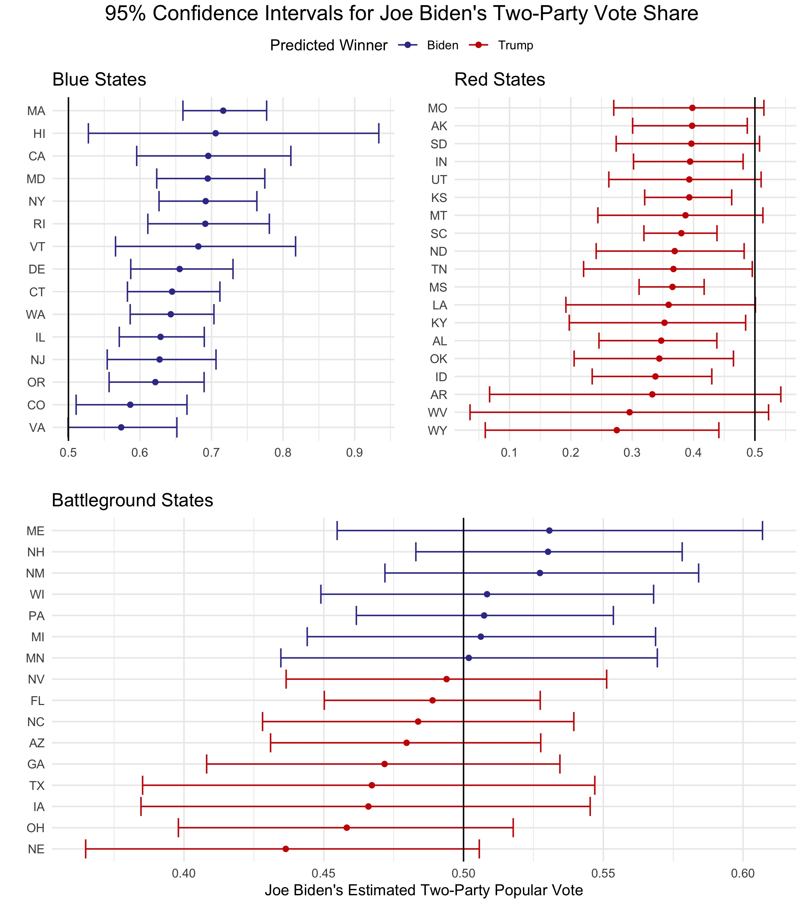

# Final Prediction
## November 1, 2020

### Overview

This forecast predicts that Joe Biden will win a popular vote victory of **52.4%** with a narrow Electoral College majority of **273** votes compared to Donald Trump's **265** votes. However, the model projects a high level of uncertainty in several battleground states. As a result, the Electoral College could easily swing further in Biden's favor or in the direction of a Trump victory.

### Model Description and Methodology

In this forecast, a binomial logistic model[^logit] predicts the state-by-state probabilities that an individual will vote for either party, using a combination of polling, economic, demographic, and incumbency data:[^data]

$$\hat{y} = g(\alpha + \beta_1\text{avg_state_poll} + \beta_2\text{incumbent} + \beta_3\text{q1_gdp_growth} + \beta_4\text{prev_dem_margin} + \beta_5\text{black_change} + \beta_6\text{age20_change} + \beta_7\text{age65_change})$$

To gauge public opinion, the model includes average *state-level polls*[^survey-monkey] in the final 4 weeks before the election. Election-year *Q1 GDP growth* captures the state of the economy, and the *incumbency* term accounts for the [incumbent](../posts/incumbency.md) advantage. Since past elections serve as excellent predictors for future elections, the forecast includes a term for the difference between Democratic and Republican state-level two-party vote share in the *previous election*. Lastly, *demographic variables*--the change in the state's Black population, age 20-30 population, and age 65+ population--capture the impact of shifting demographics on election outcomes. The Appendix includes a graph of the model's [coefficients](../figures/final/coeff_table.html), further discussion about each variable, and a more detailed description of how I arrived at my prediction from this model.

### Out-of-Sample Validation

To test the validity of this model, I performed leave-one-out cross-validation for each state in every election from 1992-2016.

For example, I constructed a model excluding Texas in 1996 and then used that model to predict the winner of the Texas popular vote in 1996. I repeated this process for all 50 states across every presidential election from 1992-2016. Then, I compared each state's predicted winners to the actual winners.

In elections from 1992-2016, this model correctly classified the statewide popular vote winner 91.85%[^oos-classification] of the time, with the following year-by-year breakdown:

| Year | Correct Classification |
|-----:|-----------------------:|
| 1992 |              0.7391304 |
| 1996 |              0.9791667 |
| 2000 |              0.9347826 |
| 2004 |              0.9767442 |
| 2008 |              0.9782609 |
| 2012 |              0.9500000 |
| 2016 |              0.8800000 |

Not surprisingly, the model performed most poorly in swing states. Across all elections from 1992-2016, the model correctly classified the popular vote winner less than 80% of the time in these 4 states:

| State | Correct Classification |
|-------|-----------------------:|
| FL    |              0.5714286 |
| WI    |              0.5714286 |
| MI    |              0.7142857 |
| PA    |              0.7142857 |

In the leave-one-out validation for 2016, the model misclassified 6 states: FL, OH, NC, MI, PA, and WI. [FiveThirtyEight](https://projects.fivethirtyeight.com/2016-election-forecast/)'s 2016 forecast correctly predicted OH but misclassified the remaining five of those six states. This model for 2020, however, includes the 2016 data and, in theory, should adjust for some of the previous pitfalls.

### 2020 Prediction

This model predicts a narrow Biden victory in the [Electoral College](../figures/final/winner_map.jpg), with a much larger margin in the popular vote:

| Candidate    | Electoral Votes | Two-Party Popular Vote |
|--------------|----------------:|------------------------|
| Joe Biden    |             273 | 0.5238088              |
| Donald Trump |             265 | 0.4761912              |

### Uncertainty Around Prediction

Any model, including this one, has a near-zero probability of predicting the exact outcome of an election. However, forecasts provide insights into the range of possible election outcomes and the surrounding uncertainty.

As visible in the map of Joe Biden's predicted win margin, this forecast anticipates close elections in many states, making a Biden landslide possible in the Electoral College if several of Trump's close states flip to blue. On the contrary, Trump could win the Electoral College if some of the slightly blue states flip to red. How can we quantify the uncertainty with this forecast? 

Confidence intervals serve as a helpful tool to measure statistical uncertainty. The below plot displays 95% confidence intervals for Joe Biden's two-party vote share in each state. If a state's interval does not contain 50%, then the forecast estimates with 95% confidence that the specified candidate will win that state's two-party vote:

Moving away from estimated vote share, the remaining probabilities in this section do **not** represent vote share estimates; rather, these probabilities represent each candidate's chance of victory. From $100,000$ election simulations, this model gives Joe Biden a **59.0%** chance of winning the Electoral College and Donald Trump a **38.9%** chance of winning the Electoral College, with a **2.1%** chance of an electoral tie:

| Probability of Biden Electoral College Victory 	| Probability of Trump Electoral College Victory 	| Probability of Electoral College Tie[^tossup] 	|
|-	|-	|-	|
| 0.59685 	| 0.38262 	| 0.02053 	|

However, Donald Trump has a much smaller chance of winning the national popular vote:

Luckily for Trump, the national popular vote does not matter if he can reach 270 Electoral College votes via statewide victories. While the forecast has a narrow Joe Biden victory as the point prediction, either candidate could reasonably win most of the battleground states:

| State | Probability of Biden Victory | Probability of Trump Victory |
|-------|-------------------------------:|-------------------------------:|
| MI    |                      0.5413900 |                     0.45861000 |
| WI    |                      0.5451600 |                     0.45484000 |
| MN    |                      0.5451800 |                     0.45482000 |
| NV    |                      0.4189772 |                     0.58102276 |
| PA    |                      0.6068800 |                     0.39312000 |
| FL    |                      0.2843436 |                     0.71565636 |
| NC    |                      0.2615635 |                     0.73843646 |
| IA    |                      0.2278800 |                     0.77212000 |
| TX    |                      0.2118627 |                     0.78813729 |
| ME    |                      0.6374500 |                     0.36255000 |
| AZ    |                      0.1783197 |                     0.82168029 |
| GA    |                      0.1754539 |                     0.82454614 |
| OH    |                      0.0752100 |                     0.92479000 |
| NE    |                      0.0462500 |                     0.95375000 |
| NH    |                      0.8432500 |                     0.15675000 |
| NM    |                      0.9064325 |                     0.09356749 |

According to this model, the three closest battleground races--MI, WI, and MN--all lean slightly in Joe Biden's favor. However, these states could easily swing in Donald Trump's favor, giving him the Electoral College victory while still losing the popular vote. [This table](../figures/final/all_states_closeness.html) lists all states and corresponding levels of uncertainty.

### Model Limitations

While this forecast performed quite well in the leave-one-out cross-validation and makes reasonable state-by-state predictions, it also has several limitations: 

* This model does not account for Washington D.C. However, D.C. has a history of voting heavily Democratic, making it [extremely likely](https://projects.fivethirtyeight.com/2020-election-forecast/district-of-columbia/) to vote Democrat in this election. For this reason, Washington D.C.'s 3 electoral votes were added to Joe Biden's Electoral College tally after allocating the votes from the 50 states.

* Due to the structure of the available data, this model treats Maine and Nebraska as winner-take-all states. However, these two states follow the [congressional district method](https://www.270towin.com/content/split-electoral-votes-maine-and-nebraska/) and can split their votes between candidates.

* The combined data[^demographic-data] for this model only dates back to 1992, which only allows for the model to fit itself with data from 7 previous elections. However, each state counts as an individual observation, increasing the total number of observations to 350. 105, 112, and 133 observations fit the blue, battleground, and red models, respectively.

* When varying voter turnout and probabilities for each simulation,[^variation] this model does so independently. A more sophisticated model would introduce some [correlation](https://statmodeling.stat.columbia.edu/2020/10/24/reverse-engineering-the-problematic-tail-behavior-of-the-fivethirtyeight-presidential-election-forecast/) between subgroups such as demographics, COVID deaths, or partisan alignment. For example, low turnout among Hispanic Democrats in Texas would likely accompany low Hispanic turnout in other southern states. While this forecast does simulate instances with lower-than-predicted probabilities of voting for Biden in Texas, the probability of voting for Biden in Texas has no bearing on the probability of voting for Biden in another state.

### Conclusion

This model predicts a narrow Democratic victory with a **273** to **265** Electoral College majority and approximately **52.4%** of the two-party popular vote. However, the close state-level vote margins, especially in battleground states, increase the level of uncertainty. 

Due to the close margins in several battleground states, the Electoral College could easily swing in the direction of a Trump victory or a Biden landslide. For example, if Joe Biden wins Michigan, Nevada, Texas, or any other state with a narrow victory projected for Trump, Biden could win far more than his projected **273** votes. However, if Trump wins New Hampshire, Nebraska, Pennsylvania, Wisconsin, or any other states projecting an extremely narrow Biden victory, he could easily tip the electoral scale in his favor. This forecast gives Joe Biden a **59.4%** chance of a Joe Biden Electoral College victory, a **38.5%** chance of a Donald Trump Electoral College victory, and a **2.1%** chance of an electoral tie.

2020 has been quite the year, and the uncertainty surrounding the 2020 election will likely only add to the chaos in the coming days.

------------------------------------------------------------------

## Appendix

This section further explains the details of this model and expands upon ideas that did not fit well into the main content of this post.

### Methodology and Steps-by-Step Breakdown

To create individualized models while avoiding overfitting, I grouped states into three separate categories: blue states, red states, and battleground states, as classified by the [New York Times](https://www.nytimes.com/interactive/2020/us/elections/election-states-biden-trump.html). Within each group of states, I constructed two models--one that predicts the probability of voting Democrat and one that predicts the probability of voting Republican--yielding a total of 6 models.

To convert the probabilities to actual vote counts within each state, I multiplied the probabilities generated by the model to each state's voting-eligible population. I simulated $100,000$ total elections for each state, with slight variations in voter turnout and voting probabilities each time.[^variation]

To produce a single value for the popular vote and Electoral College prediction, I had to aggregate the $5,000,000$ simulations in some way. For the nationwide two-party popular vote, I took the average number of voters for each party within each state, then estimated the nationwide vote count by summing each party's state-level averages. Using these two sums, I calculated the estimated two-party vote share for each party.

I assigned each state's electoral votes to the candidate who won the popular vote in the majority of the $100,000$ election simulations. Then, I summed the electors for each state and added 3 to Joe Biden's vote tally to account for Washington D.C.

### Discussion of Variables

##### State-Level Polls

A single nationwide race does not determine the winner of the presidential election, but rather, 50 state-level races combine to decide the winner. For that reason, this model makes use of state-level polling[^survey-monkey] rather than nationwide polling. Donald Trump appears to fare better in state-level polls compared to nationwide polls, which makes this model predict a closer race than if it included national polls.

To account for the increased turnout in early voting, I included polling numbers from the last four weeks leading up to the election. This method yielded the best out-of-sample fit when compared to polling intervals ranging from the last five weeks to only the last week:
1. As election day nears, two contradictory phenomena occur: polls (a) converge to the election outcome, and (b) increase in bias due to herding toward the anticipated outcome. I included the last four weeks of poll numbers in an aim to strike a balance between the contradictory effects of accurate converging and biased herding.
2. Some states do not attract much attention from pollsters, so using polls from multiple weeks increases the number of observations and reduces the likelihood of skewed polling averages due to limited sample sizes.

##### Incumbency

Incumbent candidates benefit from structural advantages, including but not limited to increased media coverage, widespread name recognition, an early start to campaigning, and more. This model incorporates incumbency status to help capture the effect of incumbency status on vote share. 

##### Q1 GDP

Data suggests that voters focus on the election-year economy at the polls as opposed to economic performance over the entire term of the incumbent.[^healy-2014] Assuming that a similar trend will hold for 2020, Donald Trump will likely face some punishment at the polls for the economy's historic lows at the beginning of the COVID-19 pandemic. However, focusing solely on the [Q2 economic numbers](../figures/economy/q2gdp.jp) completely disregards the [economic prosperity](https://www.bbc.com/news/world-45827430) before the pandemic. On the contrary, using the [extremely high](https://www.cnbc.com/2020/10/29/us-gdp-report-third-quarter-2020.html) Q3 numbers extrapolates in the other direction and minimizes the damage done by COVID-19. To balance between the highs and the lows, this model incorporates 2020 Q1 GDP growth. This metric is slightly negative due to the onset of the pandemic in the US in the final weeks of the quarter, but it is nowhere near as low as the Q2 metric. This metric more accurately reflects how I anticipate voters to assess the economy at the polls: not great, but not hopeless beyond return.

##### Previous Democratic Vote Margin

As mentioned in the main content of the post, past elections serve as one of the best predictors for current elections, especially at the state level. Incorporating each state's previous Democratic vote margin considers recent voting behavior.

##### State-Level Demographics: Change in Black Population, Change in Age 20-30 Population, and Change in 65 and Over Population

Demographics serve as strong predictors for voting behaviors, so incorporating the change in each state's Black population accounts for changing demographics in the voting population. [Black voters](https://www.pewresearch.org/fact-tank/2020/10/21/key-facts-about-black-eligible-voters-in-2020-battleground-states/) in particular lean Democratic, so this variable captures potential shifts in the partisan leaning within each state. Also, [age](https://www.aei.org/articles/2020-will-be-a-realigning-election-led-by-young-voters/) serves as a fair predictor of voting behavior: younger voters tend to vote Democratic and older voters exhibit a greater tendency to vote Republican. While conducting leave-one-out validation for models, this combination of demographic factors yielded the highest rate of classification success.

#### Coefficients

This [table](../figures/final/coeff_table.html) displays the coefficients for each model, the below figure plots the coefficients for each model. With near-zero p-values and incredibly narrow 95% confidence intervals, all coefficients are extremely significant:

The above plot illustrates the differential effects of variables on the breakdowns of parties within state subgroups. For example, Q1 GDP growth and the change in the Black population has virtually the same coefficient for both parties in traditionally blue states. However, the change in the age 20 population within blue states has a greater positive coefficient for the Democratic candidate than the Republican candidate, and the change in the age 65+ population in blue states has a positive coefficient for republicans in blue states and a negative coefficient for democrats in blue states.

### Other Notes

#### Downsides of Probabilistic Models

Well-known forecasting models give Joe Biden an extremely high probability of victory, with [The Economist](https://projects.economist.com/us-2020-forecast/president) giving Biden a 95% chance of winning the Electoral College and [FiveThirtyEight](https://projects.fivethirtyeight.com/2020-election-forecast/) giving Biden an 89% chance of winning an electoral victory. Roughly 1 in 10 people confuse probabilistic forecasts with vote share estimates, so, while these forecasters do not intend to do harm, they are likely confusing voters and creating confusion. In fact, research shows that probabilistic forecasts could have influenced the 2016 turnout and outcome in Donald Trump's favor.[^westwood] 

The section on uncertainty of this post does mention win probabilities, but I prefaced the presentation of the numbers with a note that they are not estimated vote share. Humans naturally struggle with interpreting probabilities, so that forewarning may not have been enough. However, I felt that it was important to include the probabilities since they communicate that this model gives Donald Trump a decent chance to win the Electoral College.

#### Problems with the Electoral College

Nearly [3 million](https://abcnews.go.com/Politics/hillary-clinton-officially-wins-popular-vote-29-million/story?id=44354341) more Americans voted for Hillary Clinton in 2016 than voted for Donald Trump, yet he still won the election due to the United State's Electoral College system. The win probabilities for both candidates in this forecast highlight the possibility for an electoral imbalance once again: Donald Trump has less than a 1% chance of winning the popular vote but nearly a 40% chance of winning the Electoral College. Many people argue that the Electoral College is an [outdated](https://www.history.com/news/electoral-college-founding-fathers-constitutional-convention) system with no modern merits of existence. Unfortunately, the party reaping the advantages of the Electoral College system has resisted moves to strip them of their advantage throughout history, and that pattern will likely continue for the foreseeable future.

#### "Coming Home"

As Election Day approaches, voters appear to "come home" to their partisan loyalties in many states as close races become more spread out. Two weeks before the election, this model predicted that Trump would only win Texas by less than 0.01% of the popular vote, for example. However, it now gives Donald Trump an 80% chance of winning the state and forecasts a fairly decisive Trump victory in Texas.

------------------------------------------------------------------

[^logit]: The $g(x)$ in the model equation is a logit link function that models the probability of successes as a function of covariates.

[^data]: All data for this model is publicly available online. While many online sources host the data used in this model, the data for the 2020 state-level polls came from [FiveThirtyEight](https://projects.fivethirtyeight.com/polls-page/president_polls.csv), and the national GDP growth numbers came from the [US Bureau of Economic Analysis](https://www.bea.gov/data/gdp/gross-domestic-product).

[^variation]: To vary the voting-eligible population (VEP) and the probability of voting for each party, I drew the values from a normal distribution. For the VEP, I used a normal distribution centered at each state's VEP in 2016 and used a standard deviation of twice the standard deviation of the VEP in all years from 1980-2016, anticipating greater variation in turnout due to COVID-19. To simulate fluctuations in the probability of voting for each party, I took the absolute value of a draw from a normal distribution centered at the predicted probability for 2020 with a standard deviation equivalent to that party's standard deviation of the two-party popular vote within the respective state from 1992-2016.

[^oos-classification]: Not all states had enough state-level polling data to conduct the out-of-sample validation for each year; this percentage excludes NA values.

[^tossup]: This counts the proportion of times that neither candidate received at least 270 electoral votes. In the case of a [tie](https://www.270towin.com/content/electoral-college-ties/), the House of Representatives would decide the winner of the presidential election.

[^survey-monkey]: State-level polling in 2016 did quite a [poor job](https://fivethirtyeight.com/features/the-polls-are-all-right/) of forecasting the election outcomes. Since this forecast uses state polls as the variable for public opinion, I aimed to exclude heavily biased or inaccurate polls where possible. To do this, I utilized FiveThirtyEight's [pollster ratings](https://projects.fivethirtyeight.com/pollster-ratings/). In states with enough polling data, I only included state-level polls from sources rated between A+ to C-. If a state did not have enough data with these guidelines, I loosened the restrictions to include pollsters with ratings between A+ to C/D. Notably, only one pollster did not meet these criteria. If a state did not have enough polling data within those constraints, I removed all pollster rating constraints. As one of only two pollsters to receive a rating of D-, SurveyMonkey has an extremely low rating but issues the most polls--nearly ten times as much as the second most prolific pollster. This low quality but high quantity makes polls from this source incredibly problematic. I only included SurveyMonkey polls for states that lacked sufficient state-level polling from all other pollsters.

[^healy-2014]: [Healy and Lenz, 2014] Healy, A. and Lenz, G. S. (2014). Substituting the End for the Whole: Why Voters Respond Primarily to the Election-Year Economy. American journal of political science, 58(1):31–47.

[^demographic-data]: I could only find state-level demographic data dating back to 1990. Since this model uses state-level demographic variables, it could only fit itself with data from presidential elections from 1992 to the present.

[^westwood]: [Westwood et al., 2020] Westwood, S. J., Messing, S., and Lelkes, Y. (2020). Projecting confidence: How the probabilistic horse race confuses and demobilizes the public. The Journal of politics.

