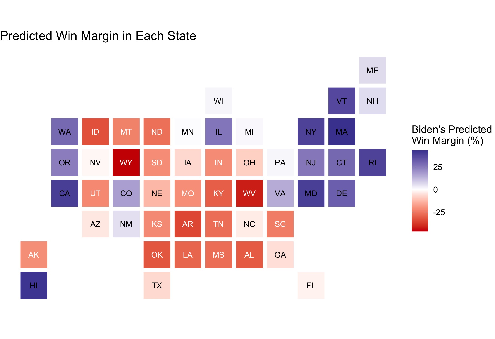

# Final Prediction
## November 1, 2020

### Overview

### The Model

https://www.wsj.com/graphics/the-paths-to-victory/

#### Model Description

$$\hat{y} ~ avg_state_poll + incumbent + gdp_growth_qt + prev_dem_margin + black_change$$

#### Variables

##### State-Level Polls

A single nationwide race does not determine the winner of the presidential election, but rather, 50 state-level races combine to decide the winner. For that reason, this model makes use of state-level polling[^survey-monkey] rather than nationwide polling. Donald Trump appears to fare better in state-level polls compared to nationwide polls, which makes this model predict a closer race than if it included national polls.

To account for the increased turnout in early voting, I included polling numbers from the last four weeks leading up to the election. This method yielded the best out-of-sample fit when compared to polling intervals ranging from last five weeks to only the last week:
1. As election day nears, two contradictory phenomena occur: polls (a) converge to the election outcome, and (b) increase in bias due to herding toward the anticipated outcome. Including the last two weeks of poll numbers allows for the accuracy due to convergence while expanding the sample in a way that does not amplify herding effects.
2. Some states do not attract much attention from pollsters, so using polls from multiple weeks increases the number of observations and reduces the likelihood of skewed polling averages due to limited sample sizes.

##### Incumbency

Incumbent candidates benefit from structural advantages, including but not limited to increased media coverage, widespread name recognition, an early start to campaigning, and more. This model incorporates incumbency status to help capture the effect of incumbency status on vote share. 

##### Q1 GDP

Data suggests that voters focus on the election-year economy at the polls as opposed to economic performance over the entire term of the incumbent.[^healy-2014] Assuming that a similar trend will hold for 2020, Donald Trump will likely face some punishment at the polls for the economy's historic lows over the course of the COVID-19 pandemic. However, focusing solely on the [Q2 economic numbers](../figures/economy/q2gdp.jp) completely disregards the [economic prosperity](https://www.bbc.com/news/world-45827430) prior to the pandemic. To balance between the highs and the lows, this model incorporates 2020 Q1 GDP growth. This metric is slightly negative due to the onset of the pandemic in the US in the final weeks of the quarter, but it is nowhere near as low as the Q2 metric. This metric more accurately reflects how I anticipate voters to assess the economy at the polls: not great, but not hopeless beyond return.

##### Previous Democratic Vote Margin

Past elections serve as one of the best predictors for current elections, especially at the state-level. Incorporating each state's previous Democratic vote margin considers recent voting behavior.

##### Change in the Black Population

Demographics serve as strong predictors for voting behaviors, so incorporating the change in each state's Black population accounts for changing demographics in the voting population. [Black voters](https://www.pewresearch.org/fact-tank/2020/10/21/key-facts-about-black-eligible-voters-in-2020-battleground-states/) in particular lean Democratic, so this variable captures potential shifts in the partisan leaning within each state.

#### Data

All data for this model is publicly available online. While many online sources host the data used in this model, the data for the 2020 state-level polls came from [FiveThirtyEight](https://projects.fivethirtyeight.com/polls-page/president_polls.csv), and the national GDP growth numbers came from the [US Bureau of Economic Analysis](https://www.bea.gov/data/gdp/gross-domestic-product).

#### Coefficients

##### Interpretation of Coefficients

#### Model Validation

##### In-Sample

##### Out-of-Sample

* incorrectly predicted a 2016 Clinton victory in FL, OH, NC, MI, PA, WI, and AZ, but 538 also got FL, NC, MI, PA, and WI wrong
* of the state/year pairings that had enough data, the model correctly classified the winner 91.850% of the time

| Year | Correct  Classification |
|-----:|------------------------:|
| 1992 |               0.8260870 |
| 1996 |               0.9375000 |
| 2000 |               0.9347826 |
| 2004 |               0.9767442 |
| 2008 |               0.9782609 |
| 2012 |               0.9250000 |
| 2016 |               0.8600000 |

Worst performing in swing states:

| State | Correct  Classification |
|-------|------------------------:|
| FL    |               0.5714286 |
| GA    |               0.7142857	|
| CO    |               0.7142857 |
| MI    |               0.7142857 |
| NC    |               0.7142857 |
| OH    |               0.7142857 |
| PA    |               0.7142857 |
| VA    |               0.7142857 |
| WI    |               0.7142857 |

### Prediction and Graphics

When applied to the 2020 data, this model predicts a narrow Biden victory in the [Electoral College](../figures/final/winner_map.jpg), with a much larger margin in the popular vote:

| Candidate    | Electoral Votes | Two-Party Popular Vote |
|--------------|----------------:|------------------------|
| Joe Biden    |             284 | 0.5400705              |
| Donald Trump |             254 | 0.4599295              |

#### Uncertainty Around Prediction

#### Prediction Discussion

A few limitations of this forecast: 
* This model does not account for Washington D.C., but I added it to Biden's electoral count because it is [extremely likely](https://projects.fivethirtyeight.com/2020-election-forecast/district-of-columbia/) to vote Democrat in this election.
* Due to the structure of the available data, this model considers Maine and Nebraska as winner-take-all states. In reality, however, the different congressional districts for these states could go to separate candidates.
* The combined data for this model only dates back to 1992, which only provides 7 previous elections from which to construct this model. However, each state in each election counts as an individual observation, which substantially increases the sample size relative to a nationwide model. Of the three models, the blue model has 105 observations, the battleground model has 112 observations, and the red model has 133 observations.

As Election Day approaches, the predicted vote shares for each candidate from each state diverged as voters appear to "come home" to their partisan loyalties. Two weeks prior to the election, this model predicted that Trump would only win Texas by less than 0.01% of the popular vote, for example. However, it now forecasts a fairly decisive Trump victory for the blue-trending but historically red state.

------------------------------------------------------------------

[^survey-monkey]: I omitted SurveyMonkey polls from my data after G. Elliot Morris spoke in class about how he does not include their polls due to bias. Also, FiveThirtyEight rates SurveyMonkey a D-, which is the lowest grade of any pollster. This data is especially problematic because SurveyMonkey byfar issues the most polls, by nearly ten times as much as the second most prolific pollster. For states that did not have enough state-level polls after omitting SurveyMonkey data, I included polls from the site.

[^healy-2014]: [Healy and Lenz, 2014] Healy, A. and Lenz, G. S. (2014). Substituting the End for the Whole: Why Voters Respond Primarily to the Election-Year Economy. American journal of political science, 58(1):31–47.

