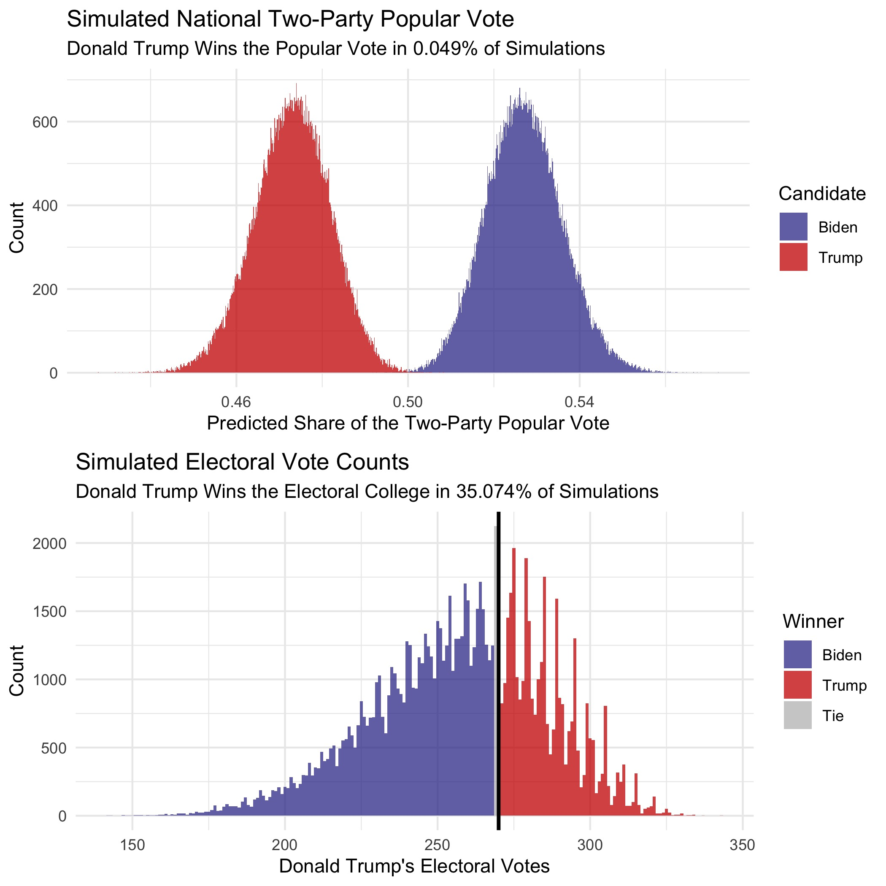
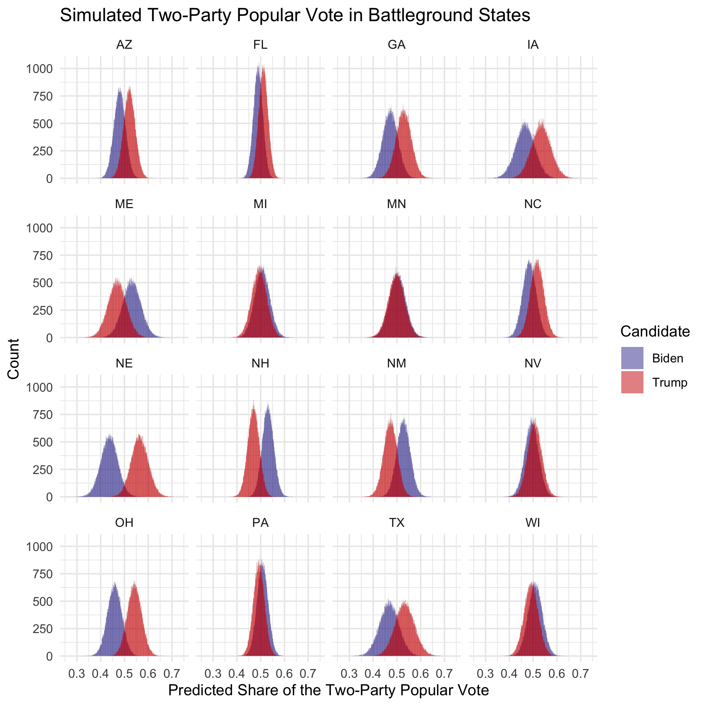

# Final Prediction
## November 1, 2020

### Overview

While many forecasters confidently project a Biden victory, how warranted is this enthusiasm? After all, some professional forecasters gave Hillary Clinton over a [90% chance](https://www.nytimes.com/newsgraphics/2016/10/18/presidential-forecast-updates/newsletter.html) of winning the 2016 election. Not much has changed in 2020; as of October 20, FiveThirtyEight gives Joe Biden an [88% chance](https://projects.fivethirtyeight.com/2020-election-forecast/) of defeating Donald Trump in the 2020 election.

This forecast predicts a narrow Joe Biden victory, but with far less confidence than other predictions. While Joe Biden is predicted to win the popular vote by a sizable margin of **INSERT PERCENT HERE**, the forecast predicts that Biden will squeak by with an Electoral College majority of **INSERT ELECTORAL COUNT HERE**. In a total of $100,000$ simulations, Joe Biden won the Electoral College **INSERT PERCENT HERE** of the time, Donald Trump won the Electoral College **INSERT PERCENT HERE** of the time, and neither candidate received 270 votes **INSERT PERCENT HERE** of the time.

#### Model Description and Methodology

This forecast uses a binomial logistic model to predict the probability that each member of the state's voting-eligible population would vote for either party. The underlying model maps the predicted vote probability using a combination of polling, economic, demographic, and incumbency data:[^data]

$$\hat{y} ~ avg_state_poll + incumbent + gdp_growth_qt + prev_dem_margin + black_change + age20_change + age65_change$$

To have a model specific to a state's characteristics without overfitting the data for each individual state, I grouped states into three separate categories: blue states, red states, and battleground states, as classified by the [New York Times](https://www.nytimes.com/interactive/2020/us/elections/election-states-biden-trump.html). Within each group of states, I constructed one model to predict the probability of voting Democrat and one model to predict the probability of voting Republican.

After predicting the probabilities for each state's partisan turnout, I simulated the number of voters for each party, applying the probability to the voting-eligible population for that state, slightly varying the probabilities and the turnout each time[^variation].

See the Appendix for a discussion about the inclusion of each of these variables and a visualization of each model's [coefficients](../figures/final/coeff_table.html).

#### Out-of-Sample Validation

This model correctly classified the winner of the statewide popular vote in 91.85%[^oos-classification] of states in elections from 1992-2016, with the following year-by-year breakdown:

| Year | Correct Classification |
|-----:|-----------------------:|
| 1992 |              0.7391304 |
| 1996 |              0.9791667 |
| 2000 |              0.9347826 |
| 2004 |              0.9767442 |
| 2008 |              0.9782609 |
| 2012 |              0.9500000 |
| 2016 |              0.8800000 |

Not surprisingly, the model performed the worse in swing states. Across all elections from 1992-2016, the model correctly classified the popular vote winner less than 80% of the time in these 4 states:

| State | Correct Classification |
|-------|-----------------------:|
| FL    |              0.5714286 |
| WI    |              0.5714286 |
| MI    |              0.7142857 |
| PA    |              0.7142857 |

In the leave-one-out validation for 2016, the model incorrectly classified 6 states: FL, OH, NC, MI, PA, and WI. [FiveThirtyEight](https://projects.fivethirtyeight.com/2016-election-forecast/)'s 2016 forecast correctly predicted OH, but misclassified the remaining five of those six states. However, since the models applied to 2020 include data from the 2016 election, the coefficients should adjust to Donald Trump's unusual political prowess.

### 2020 Prediction

When applied to the 2020 data, this model predicts a narrow Biden victory in the [Electoral College](../figures/final/winner_map.jpg), with a much larger margin in the popular vote:

| Candidate    | Electoral Votes | Two-Party Popular Vote |
|--------------|----------------:|------------------------|
| Joe Biden    |             273 | 0.5238088              |
| Donald Trump |             265 | 0.4761912              |

### Uncertainty Around Prediction

As visible in the map of Joe Biden's predicted win margin, many states will likely have close elections, and the election could easily swing further in Biden's favor if some of Trump's close states flip to blue. However, a victory for Trump is not out of reach due to the extremely close electoral count in this model. How can we quantify the uncertainty with this forecast? The probabilities in this section are **not** estimated vote shares; rather, these probabilities represent each candidate's chance of winning the Electoral College, nationwide popular vote, or statewide popular vote in the [battleground states](https://www.nytimes.com/interactive/2020/us/elections/election-states-biden-trump.html).

In 100,000 simulations of the election, Joe Biden won the Electoral College most frequently, but a Donald Trump victory is not out of reach:

| Biden Victory | Trump Victory | Tossup[^tossup]|
|---------------|---------------|----------|
| 0.59036       | 0.38873       | 0.02091  |

However, Donald Trump has a much smaller chance of winning the national popular vote:

Luckily for Trump, the nationwide popular vote does not matter if he secures enough statewide popular vote victories to secure 270 Electoral College votes. While the forecast does project a narrow Joe Biden victory, either candidate could reasonably win most of the battleground states:

| State | Probability of Biden Victory | Probability of Trump Victory |
|-------|-------------------------------:|-------------------------------:|
| MI    |                      0.5413900 |                     0.45861000 |
| WI    |                      0.5451600 |                     0.45484000 |
| MN    |                      0.5451800 |                     0.45482000 |
| NV    |                      0.4189772 |                     0.58102276 |
| PA    |                      0.6068800 |                     0.39312000 |
| FL    |                      0.2843436 |                     0.71565636 |
| NC    |                      0.2615635 |                     0.73843646 |
| IA    |                      0.2278800 |                     0.77212000 |
| TX    |                      0.2118627 |                     0.78813729 |
| ME    |                      0.6374500 |                     0.36255000 |
| AZ    |                      0.1783197 |                     0.82168029 |
| GA    |                      0.1754539 |                     0.82454614 |
| OH    |                      0.0752100 |                     0.92479000 |
| NE    |                      0.0462500 |                     0.95375000 |
| NH    |                      0.8432500 |                     0.15675000 |
| NM    |                      0.9064325 |                     0.09356749 |

The three closest races in battleground states according to this model--MI, WI, and MN--all lean slightly in Joe Biden's favor according to this model. However, Donald Trump could easily win these states and the Electoral College while still losing the popular vote.

#### Model Limitations

While this forecast performed quite well in the leave-one-out cross-validation and makes reasonable predictions given what we know about states, it is by no means perfect: 

* This model does not account for Washington D.C. However, D.C. has a history of voting heavily Democratic, making it [extremely likely](https://projects.fivethirtyeight.com/2020-election-forecast/district-of-columbia/) to vote Democrat in this election. For this reason, Washington D.C.'s 3 electoral votes were added to Joe Biden's tally after running the model for the 50 states.

* Due to the structure of the available data, this model considers Maine and Nebraska as winner-take-all states. However, these two states follow the [congressional district method](https://www.270towin.com/content/split-electoral-votes-maine-and-nebraska/) and could actually split their votes.

* The combined data for this model only dates back to 1992, so this model is built off of only 7 previous elections. However, each state in each election counts as an individual observation, which substantially increases the sample size relative to a nationwide model. The blue, battleground, and red models are build from 105, 112, and 133 observations in the data, respectively.

#### Conclusion

While this model predicts a narrow Democratic victory in both the Electoral College and popular vote, at **INSERT VOTES HERE** and **INSERT PERCENT HERE** respectively, the close margins, especially in battleground states, give reason for uncertainty. This forecast gives Joe Biden an approximate **INSERT WIN PERCENTAGE HERE** chance of victory, Donald Trump a **INSERT WIN PERCENTAGE HERE** chance of victory, and a **INSERT WIN PERCENTAGE HERE** chance that the House of Representatives will have to decide the election.

Due to the close margins in several battleground states, the election could swing either way. For example, if Joe Biden wins, Michigan, Nevada, Texas, or any other state with a narrow victory projected for Trump, Biden could win the electoral vote by far more than the predicted **INSERT EV COUNT HERE** votes. However, if Trump wins New Hampshire, Nebraska, Pennsylvania, Wisconsin, or any other states projecting an extremely narrow Biden victory, he could easily tip the electoral scale in his favor.

------------------------------------------------------------------

### Appendix

#### Discussion of Variables

##### State-Level Polls

A single nationwide race does not determine the winner of the presidential election, but rather, 50 state-level races combine to decide the winner. For that reason, this model makes use of state-level polling[^survey-monkey] rather than nationwide polling. Donald Trump appears to fare better in state-level polls compared to nationwide polls, which makes this model predict a closer race than if it included national polls.

To account for the increased turnout in early voting, I included polling numbers from the last four weeks leading up to the election. This method yielded the best out-of-sample fit when compared to polling intervals ranging from last five weeks to only the last week:
1. As election day nears, two contradictory phenomena occur: polls (a) converge to the election outcome, and (b) increase in bias due to herding toward the anticipated outcome. Including the last two weeks of poll numbers allows for the accuracy due to convergence while expanding the sample in a way that does not amplify herding effects.
2. Some states do not attract much attention from pollsters, so using polls from multiple weeks increases the number of observations and reduces the likelihood of skewed polling averages due to limited sample sizes.

##### Incumbency

Incumbent candidates benefit from structural advantages, including but not limited to increased media coverage, widespread name recognition, an early start to campaigning, and more. This model incorporates incumbency status to help capture the effect of incumbency status on vote share. 

##### Q1 GDP

Data suggests that voters focus on the election-year economy at the polls as opposed to economic performance over the entire term of the incumbent.[^healy-2014] Assuming that a similar trend will hold for 2020, Donald Trump will likely face some punishment at the polls for the economy's historic lows over the course of the COVID-19 pandemic. However, focusing solely on the [Q2 economic numbers](../figures/economy/q2gdp.jp) completely disregards the [economic prosperity](https://www.bbc.com/news/world-45827430) prior to the pandemic. To balance between the highs and the lows, this model incorporates 2020 Q1 GDP growth. This metric is slightly negative due to the onset of the pandemic in the US in the final weeks of the quarter, but it is nowhere near as low as the Q2 metric. This metric more accurately reflects how I anticipate voters to assess the economy at the polls: not great, but not hopeless beyond return.

##### Previous Democratic Vote Margin

Past elections serve as one of the best predictors for current elections, especially at the state-level. Incorporating each state's previous Democratic vote margin considers recent voting behavior.

##### State-Level Demographics: Change in Black Population, Change in Age 20-30 Population, and Change in 65 and Over Population

Demographics serve as strong predictors for voting behaviors, so incorporating the change in each state's Black population accounts for changing demographics in the voting population. [Black voters](https://www.pewresearch.org/fact-tank/2020/10/21/key-facts-about-black-eligible-voters-in-2020-battleground-states/) in particular lean Democratic, so this variable captures potential shifts in the partisan leaning within each state. Also, [age](https://www.aei.org/articles/2020-will-be-a-realigning-election-led-by-young-voters/) serves as a fair predictor of voting behavior: younger voters tend to vote Democratic and older voters exhibit a greater tendency to vote Republican. While conducting leave-one-out validation for models, this combination of demographic factors yielded the highest rate of classification success.

#### Coefficients

This [table](../figures/final/coeff_table.html) displays the coefficients for each model, the below figure plots the coefficients for each model. Every coefficient was highly significant with near-zero p-values and incredibly narrow 95% confidence intervals:

#### "Coming Home"

As Election Day approaches, the predicted vote shares for each candidate from each state diverged as voters appear to "come home" to their partisan loyalties. Two weeks prior to the election, this model predicted that Trump would only win Texas by less than 0.01% of the popular vote, for example. However, it now forecasts a fairly decisive Trump victory for the blue-trending but historically red state.

------------------------------------------------------------------

[^data]: All data for this model is publicly available online. While many online sources host the data used in this model, the data for the 2020 state-level polls came from [FiveThirtyEight](https://projects.fivethirtyeight.com/polls-page/president_polls.csv), and the national GDP growth numbers came from the [US Bureau of Economic Analysis](https://www.bea.gov/data/gdp/gross-domestic-product).

[^variation]: In order to vary the voting-eligible population (VEP) and the probability of voting for each party, I drew the values from a normal distribution. For the VEP, I used a normal distribution centered at each state's VEP in 2016 and used a standard deviation of twice the standard deviation of the VEP in all years from 1980-2016, anticipating greater variation in turnout due to COVID-19. 
  To simulate fluctuations in the probability of voting for each party, I took the absolute value of a draw from a normal distribution centered at the predicted probability for 2020 with a standard deviation equivalent to that party's standard deviation of two-party popular vote within the respective state from 1992-2016.

[^oos-classification]: Not all states had enough state-level polling data to conduct the out-of-sample validation for each year; this percentage excludes NA values.

[^tossup]: This counts the proportion of times that neither candidate received at least 270 electoral votes. In the case of a [tie](https://www.270towin.com/content/electoral-college-ties/), the House of Representatives would decide the winner of the presidential election.

[^survey-monkey]: I omitted SurveyMonkey polls from my data after G. Elliot Morris spoke in class about how he does not include their polls due to bias. Also, FiveThirtyEight rates SurveyMonkey a D-, which is the lowest grade of any pollster. This data is especially problematic because SurveyMonkey byfar issues the most polls, by nearly ten times as much as the second most prolific pollster. For states that did not have enough state-level polls after omitting SurveyMonkey data, I included polls from the site.

[^healy-2014]: [Healy and Lenz, 2014] Healy, A. and Lenz, G. S. (2014). Substituting the End for the Whole: Why Voters Respond Primarily to the Election-Year Economy. American journal of political science, 58(1):31–47.

