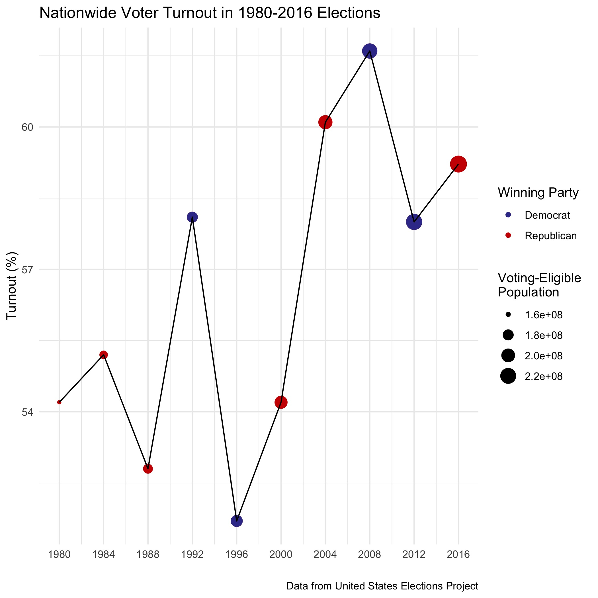
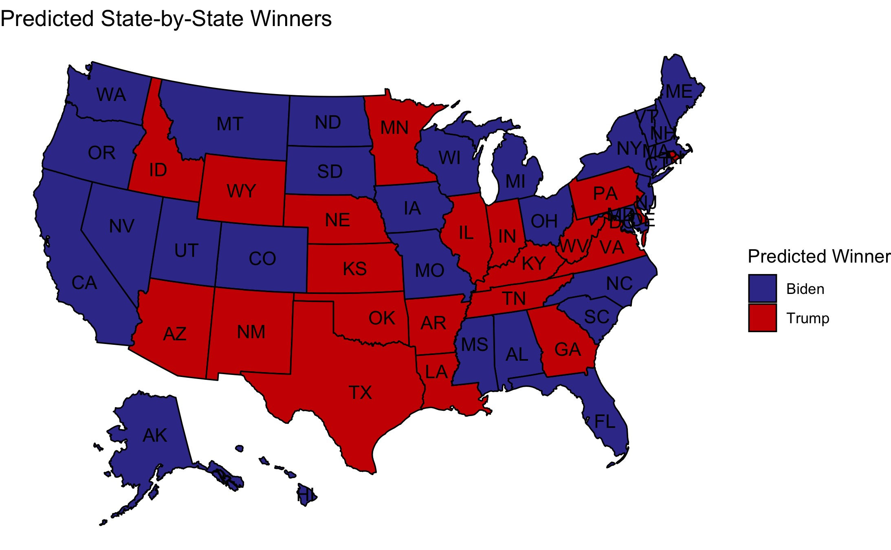
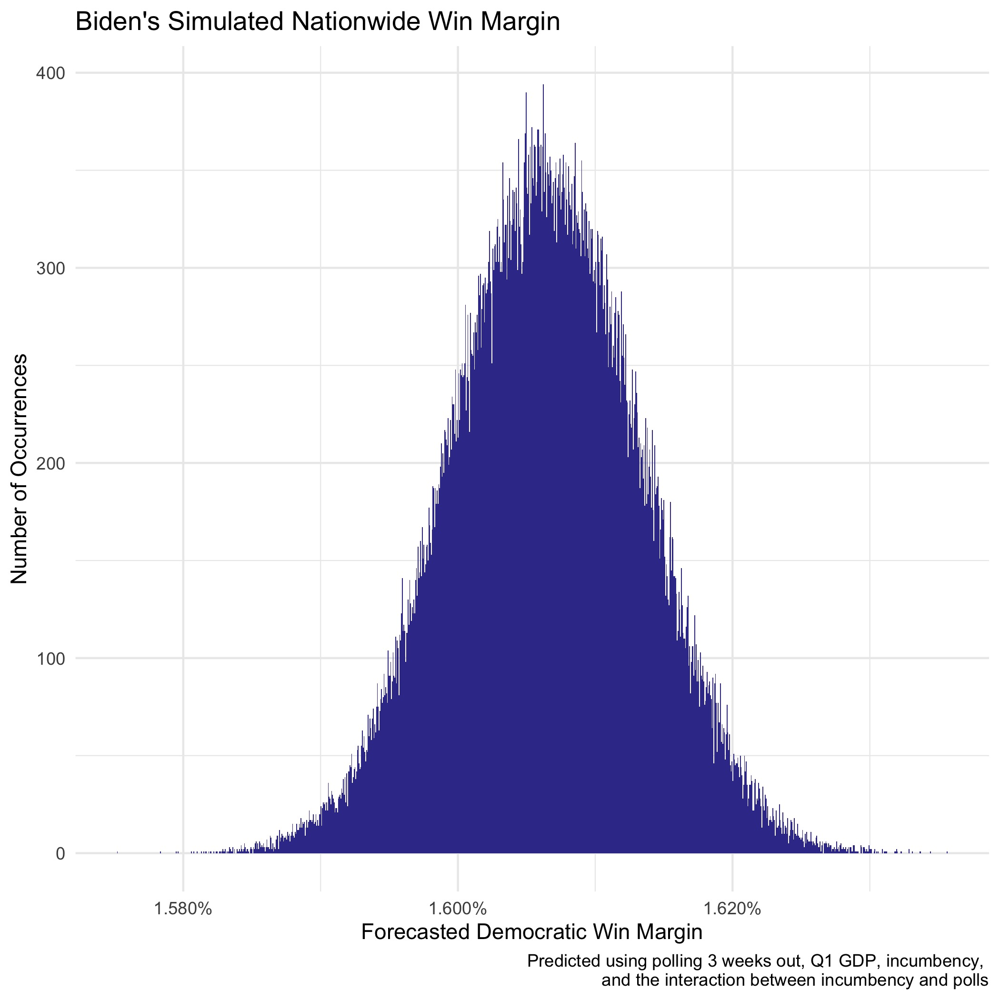

# Voter Turnout
## October 17, 2020

### Importance of Ground Game in Voter Turnout

### Turnout in 2020

A healthy democracy must have reasonable voter turnout. Many marginalized groups have fought for the right to vote, only for people to take that right for granted a generation later. In recent years, voter turnout has generally increased, with slightly greater turnout when neither party has an incumbent candidate:

How will the 2020 election fit into this picture? In 2019, before the birth of COVID-19, experts predicted [historic](https://www.usnews.com/news/elections/articles/2019-09-20/experts-predict-huge-turnout-in-2020) turnout of approximately 66%[^vep] for the 2020 election. A movement in either direction seems sensible for 2020: either the pandemic (a) stifles turnout on Election Day due to confusion over voting by mail and questions about the safety of in-person voting, or (b) empowers people to vote for the candidate they believe can provide strong leadership in these turbulent times. 

It turns out that experts still a [record-high turnout](https://www.theatlantic.com/politics/archive/2020/10/2020-election-turnout/616640/) in the 2020 election, with the predicted surge strengthened by the pandemic. Similar to the prediction in 2019, estimates still sit at approximately [65%](https://thehill.com/homenews/campaign/520313-experts-predict-record-election-turnout-as-more-than-66-million-ballots).

With zero previous elections with circumstances resembling 2020, this year's primaries are the best source of information about how voters will behave in the midst of a global pandemic. Turnout in primaries generally pales in comparison to general election turnout, with numbers sitting around 3%-46% and 60% respectively, and this disparity is generally amplified in years with an incumbent candidate. However, the 2020 primary drew far more[ attention](https://www.nytimes.com/2020/07/21/us/politics/biden-2020.html) than expected. While most of the showing came from the Democratic side since that was the only competitive primary (and even that was short lived), this larger-than-expected turnout could be a positive sign that COVID-19 will not drastically decrease, and may even increase, turnout come November.

#### A Note on Voting by Mail

Different states have different [regulations](https://www.nytimes.com/interactive/2020/08/11/us/politics/vote-by-mail-us-states.html) regarding voting by mail. In the presidential primaries, states that encouraged people to vote by mail experienced impressive [success](https://fivethirtyeight.com/features/there-have-been-38-statewide-elections-during-the-pandemic-heres-how-they-went/). Naturally, states that mailed every voter an absentee ballot saw the greatest share of votes cast absentee, and states that did not mail anything and required a non-COVID excuse to vote absentee had the lowest share of absentee voting.

Many Republicans [believe](https://www.nytimes.com/2020/05/25/us/vote-by-mail-coronavirus.html) that widespread absentee voting will benefit Democrats, so people may attempt to manipulate voting by mail measures to stifle the vote of certain subsets of the electorate. Fortunately, most states requiring non-COVID-19 excuses for absentee voting reliably vote Republican, most states mailing ballots to all voters reliably vote Democratic, and most swing states allow absentee voting for all but do not nudge in one way or another. While the concern about attempts to manipulate voter turnout are certainly valid, it appears that policies enacted by states will only serve to reinforce existing voting tendencies.

While voting by mail removed some barriers to voting, states that do not have such policies 

#### How [FiveThirtyEight's Forecast](https://fivethirtyeight.com/features/how-fivethirtyeights-2020-presidential-forecast-works-and-whats-different-because-of-covid-19/) Deals with Unpredictability

While it is a relief to know that voter turnout is not guaranteed to be lower due to COVID-19, forecasters are still faced with less predictability in turnout numbers. Nate Silver's forecast at FiveThirtyEight considers many factors in attempting to account for less predictable turnout due to COVID-19 and resulting uncertainty in Election Day results:

* Relative ease of voting in each state - generally, easier voting leads to higher turnout and an increased proportion of Democratic votes.
* Projected turnout by state - uses population growth since 2016, changes in relative ease of voting since 2016, and current closeness of the race, since closer-polling states tend to experience higher turnout.
* Variability in voting in primaries - turnout in primaries was approximately 50% higher in primaries after COVID-19 came to the US than before.
    * COVID-19 made turnout in primaries more difficult to predict; voting by mail made voting easier in certain states, while difficulties with social distancing at in-person polls added a barrier for other voters.
    * States with drastic shifts in turnout between election cycles are more difficult to forecast.

With the above factors in mind, Nate Silver estimates a 50% increase in error when predicting voter turnout and a 20% increase in error when predicting vote share for each party. As a result of how COVID-19 may affect turnout and the voting process, FiveThirtyEight's model increased Election Day error, correlated state error, and state-specific error by 20% relative to typical values.

#### How the [Economist Forecast](https://projects.economist.com/us-2020-forecast/president/how-this-works) Adjusts for Turnout

Most of the Economist's discussions surrounding turnout variability center around polling bias rather than COVID-19. Polls conducted on all adults will inevitably include the views of people that will not vote in the general election, which introduces biases regarding voter turnout. Pollsters attempt to mend this by strategically weighting the responses of individuals likely to vote, but this introduces another layer of bias unique to that pollster's method. 

Over time, different pollsters will conduct surveys in the same areas, and the Economist's model compares the results of these different polls on similar populations and adjusts for the differences. 

#### Comparing FiveThirtyEight and the Economist

While polling biases certainly pose problems, FiveThirtyEight's detailed handling of COVID-19-specific issues seems a bit more appropriate for the current circumstances. However, this is the Economist's first statistical election prediction model, so they very well could be considering the same measures but neglected to include a lengthy description of it since they did not have any other models setting a precedent.

### Modeling Election Outcomes with Variability in Turnout

#### State-by-State Model

avg_support * incumbent + gdp_growth_qt + black_change +
            hispanic_change + age20_change + consec_dem + consec_rep

#### National Model

A national model predicts that Biden will receive approximately **52.8%** two-party popular vote, with Trump receiving **47.2%**.	
- simulate fluctuations in turnout

avg_support * incumbent + gdp_growth_qt

### Looking Ahead

- uncertain impact on turnout due to the shock of COVID-19... turnout is only one of the factors impacted by the pandemic. Retrospective voting raises the question of how voters may punish/reward the incumbent for the handling not only of COVID-19, but also of wildfires, hurricanes, racial injustice protests, and more. moving forward to examine shocks next week

[^vep]: Turnout percentages reported throughout this post refer to the percentage of the voting-eligible population (VEP) that casts ballots.

