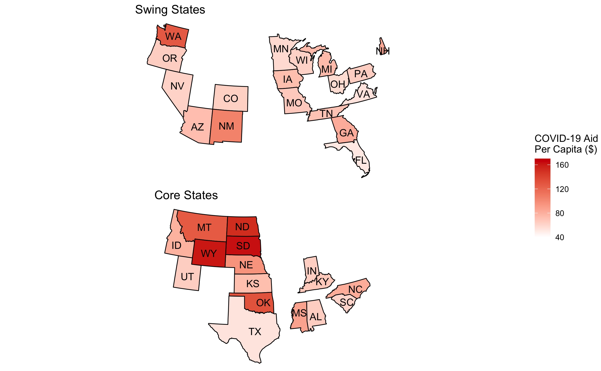

# Incumbency and Elections
## October 3, 2020

#### **CITE DATA SOURCES**

### Background on Incumbency Advantage

Since 1948, 72.7% of sitting presidents have won re-election, with only 3 incumbent candidates failing to earn a second term. However, incumbency status alone does not motivate voters to re-elect a sitting president.[^incumbent-advantage] Instead, the sitting presidents reap the benefits of structural factors such as increased media coverage, an early start to campaigning, and the power to influence state- and local-level funding.

### Visualizing Federal Grant Aid, COVID-19 Relief Aid

A vast body of political literates explores the influence of federal spending on elections.[^Kriner-and-Reeves] Overall, it appears that incumbents and the incumbent party focus their federal dollars on swing states relative to states core to their base, with a greater emphasis on election years:

However, the states classified as "swing" states have much larger [populations](../figures/incumbency/state_type_populations.jpg) relative to the "core" states. What happens when we control for this? It turns out that per capita federal grant spending is greatest during core states in election years, then in core states in nonelection years, then followed by swing states:

How does this pattern hold for COVID-19 relief funding? The below plots display per capita COVID-19 grant money for core and swing states:

### Trump and Incumbency

Can Trump's status as an incumbent carry him to a victory in 2020?

Does the incumbency advantage apply to Trump? Explain why or why not

- Harvard Republicans endorse Trump
- familiarity with the name is especially true
- media coverage fires up Trump's base

### Comparing Last Week's Regression to Time-for-Change

Based on this week's analyses of federal grants and incumbency advantage, update your most recent prediction of Trump's 2020 popular vote share (you may rely on previous models, the model in section, and the readings)

- T4C model maps two-party vote share for the incumbent party from Q2 GDP growth, Gallup job approval, and whether or not it's a sitting president
- have OOS fit and regression output for both models, can include in this to compare... also calculated adj-r-sq for both

[^incumbent-advantage]: [Brown, 2014] Brown, A. R. (2014).Voters Don’t Care Much About Incumbency.Journalof Experimental Political Science, 1(2):132–143.

[^Kriner-and-Reeves]: [Kriner and Reeves, 2012] Kriner, D. L. and Reeves, A. (2012).The influence of federalspending on presidential elections.American Political Science Review, pages 348–366.

Also, data on federal grant allocations from 1984-2016 came from their work as well.

