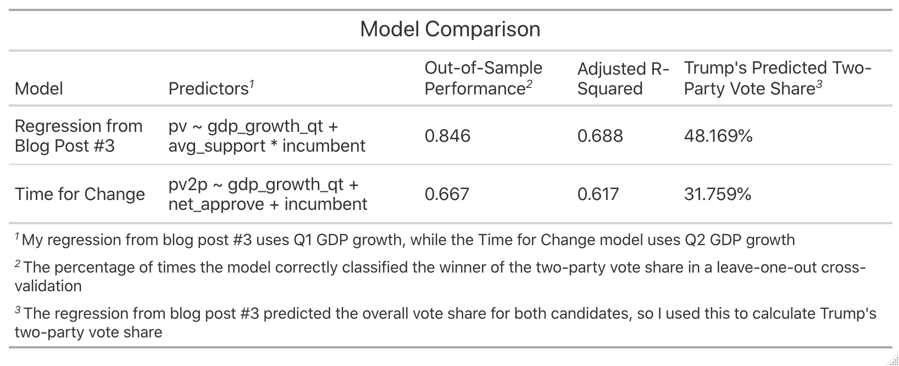

# Incumbency and Elections
## October 3, 2020

### The Incumbency Advantage

Since 1948, 72.7% of sitting presidents have won re-election, with only 3 incumbent candidates failing to earn a second term. However, incumbency status alone does not motivate voters to re-elect a sitting president.[^incumbent-advantage] Instead, incumbent candidates reap the benefits of structural factors such as increased media coverage, an early start to campaigning, and the power to influence state- and local-level funding. With the 2020 election just a month away, this blog post considers how incumbency may factor into the 2020 outcome.

### Visualizing Federal Grant Aid and COVID-19 Relief Aid

A vast body of political literates explores the influence of federal spending on elections.[^Kriner-and-Reeves] Overall, it appears that incumbents and the incumbent party focus a greater magnitude of federal dollars on swing states relative to states core to their base, with a greater emphasis on election years.

However, the states classified as "swing" states have much larger [populations](../figures/incumbency/state_type_populations.jpg) relative to the "core" states. What happens when we control for this? It turns out that per capita federal grant spending is greatest in core states during election years, then in core states in non-election years, then followed by swing states:

How does this pattern hold for COVID-19 relief funding? The below plots display per capita COVID-19 grant money for core and swing states:

It makes sense that the incumbent party would want to increase federal grant aid in election years to increase favorability in the eyes of the voters. However, one would think that incumbent parties would choose to pour more dollars into battleground states. Controlling for population size essentially eliminates this effect.

### Comparing Last Week's Regression to PollyVote's *Time for Change* Model

On the topic of incumbency, PollyVote's [Time for Change](https://pollyvote.com/en/components/models/retrospective/fundamentals-plus-models/time-for-change-model/) model incorporates incumbency into its election predictions. As one of the few major polls that predicted at 2016 victory, it has earned the respect of forecasters around the country. The model predicts the two-party popular vote of the incumbent party from Q2 GDP growth, Gallup approval polls, and incumbency status. The model has an adjusted r-squared of 61.7% and correctly classified the popular vote winner in 66.7% of post-WWII elections in a [leave-one-out cross-validation](../figures/incumbency_tfc_leave_one_out.html). In the end, it predicts that Trump will win 31.8% of the two-party popular vote.

Last week's [regression](../figures/polling/both_regression.jpeg) mapped popular vote share from Q1 GDP growth, polling numbers from 6 weeks out, and the interaction between incumbency and poll numbers. It had an adjusted r-squared of 0.688 and correctly classified 76.9% of the past elections in [leave-one-out cross validation](../figures/polling/both_model_classification.html). The model predicted that Joe Biden would receive approximately 51.2% of the overall popular vote and Trump would earn 47.6% of the popular vote, which amounts to a two-party vote share of 48.2% for Donald Trump. 

### Trump and Incumbency

After numerous controversies, including the leaking of the [Access Hollywood Tape](https://www.washingtonpost.com/politics/trump-recorded-having-extremely-lewd-conversation-about-women-in-2005/2016/10/07/3b9ce776-8cb4-11e6-bf8a-3d26847eeed4_story.html), Donald Trump's 2016 victory taught us that he could quite possibly [shoot someone in the middle of Fifth Avenue](https://www.washingtonpost.com/politics/trump-recorded-having-extremely-lewd-conversation-about-women-in-2005/2016/10/07/3b9ce776-8cb4-11e6-bf8a-3d26847eeed4_story.html) and not lose any voters. However, 2020 is a new race. Can Trump's status as an incumbent carry him to a victory? 

The horrific [Q2 economic numbers](https://www.bea.gov/news/2020/gross-domestic-product-2nd-quarter-2020-advance-estimate-and-annual-update), his [downplaying](https://abcnews.go.com/Politics/trump-admitted-deliberately-played-coronavirus-threat-reports/story?id=72904348) of the threat of COVID-19, and his years of [tax avoidance](https://www.nytimes.com/interactive/2020/09/27/us/donald-trump-taxes.html) *should* hurt his re-election chances. In the face of this adversity, however, Trump's approval ratings have remained relatively [stable](https://www.pewresearch.org/fact-tank/2020/08/24/trumps-approval-ratings-so-far-are-unusually-stable-and-deeply-partisan/). Incumbents typically benefit from greater media coverage, and Trump's antics over the past four years have earned him his fair share of air time. In our deeply polarized political environment, this additional attention likely energizes his base. After all, his 2016 victory proved that many of his supporters do not mind the controversy surrounding him. On top of his pre-existing base, Trump still has managed to [convert](https://www.thecrimson.com/article/2020/9/30/harvard-republicans-endorse-trump/) some people in 2020 that did not support him in 2016.

On the other hand, incumbents may also face backlash for factors outside of their control.[^shark-attacks] 2020 has had its fair share of shocks with COVID-19, the wildfires in California, racial injustice protests, and more. Trump's base has shown that it will support him even while he openly brags about sexual assault, mocks [disabilities](https://time.com/4531902/marlee-matlin-donald-trump-deaf-retarded-comment/), and neglects to denounce [white supremacists](https://www.nytimes.com/2020/09/30/us/politics/trump-debate-white-supremacy.html). After Trump's controversial victory in 2016, I believe that Trump's loyal base will not attribute the disasters of 2020 to Trump, whether he is to blame or not. In my opinion, most people that attribute blame to Trump for any of the disasters of the past year were unlikely to support him in the first place.

While the models predict that Trump's incumbency status may not be enough to carry him to victory, I do believe the incumbency advantage will still benefit Trump.

[^incumbent-advantage]: [Brown, 2014] Brown, A. R. (2014).Voters Don’t Care Much About Incumbency.Journalof Experimental Political Science, 1(2):132–143.

[^Kriner-and-Reeves]: [Kriner and Reeves, 2012] Kriner, D. L. and Reeves, A. (2012).The influence of federal spending on presidential elections.American Political Science Review, pages 348–366.

Also, data on federal grant allocations from 1984-2016 came from their work as well.

[^shark-attacks]: [Achen and Bartels, 2017] Achen, C. H. and Bartels, L. M. (2017). Democracy for realists:Why elections do not produce responsive government, volume 4.  Princeton University

