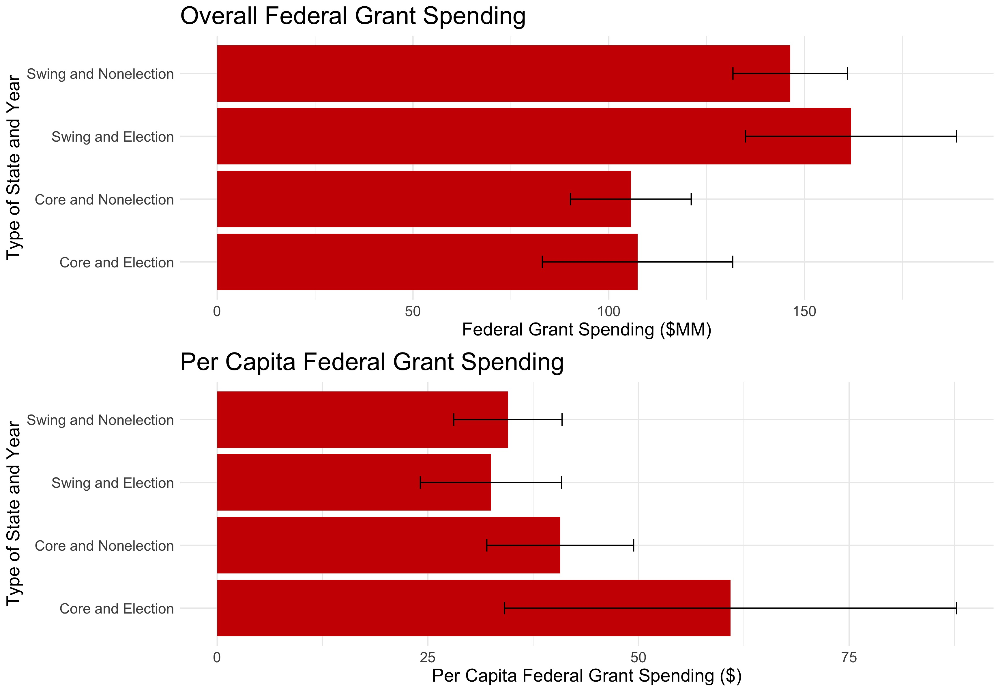

# Incumbency and Elections
## October 3, 2020

#### **CITE DATA SOURCES**

### Background on Incumbency Advantage

- media coverage
- familiarity
- campaign finance
- "pork"

### Visualizing Federal Grant Aid, COVID-19 Relif Aid

Overall, it appears that incumbents and the incumbent party focus their federal dollars on swing states relative to states core to their base, and moreso during election years:

However, the states classified as "swing" states have much larger [populations](../figures/incumbency/state_type_populations.jpg) relative to the "core" states. What happens when we control for this? It turns out that per capita federal grant spending is greatest during core states in election years, then in core states in nonelection years, then followed by swing states:

- Visualize federal aid allocated at the state level towards COVID-19 relief
- per capita corona funding?
- compare with federal spending overall in non-covid years

### Trump and Incumbency

Does the incumbency advantage apply to Trump? Explain why or why not

- Harvard Republicans endorse Trump
- familiarity with the name is especially true
- media coverage fires up Trump's base

### Comparing Last Week's Regression to Time-for-Change

Based on this week's analyses of federal grants and incumbency advantage, update your most recent prediction of Trump's 2020 popular vote share (you may rely on previous models, the model in section, and the readings)

- T4C model maps two-party vote share for the incumbent party from Q2 GDP growth, Gallup job approval, and whether or not it's a sitting president
- have OOS fit and regression output for both models, can include in this to compare... also calculated adj-r-sq for both
