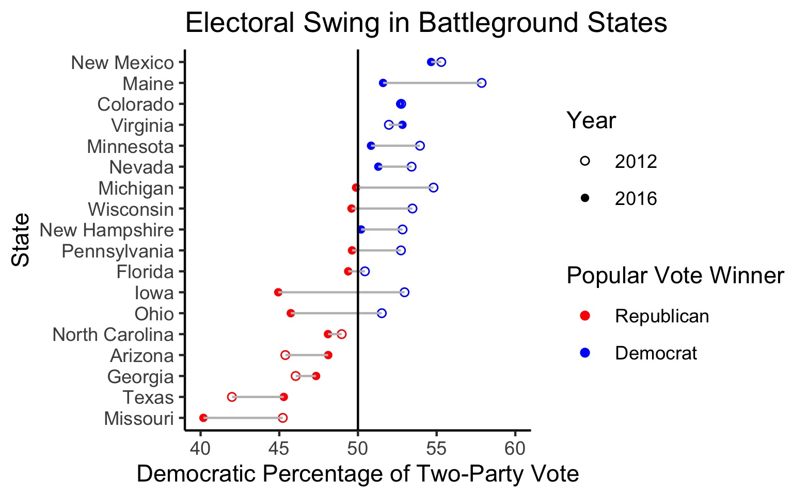

# Introduction: Past Presidential Election Results
## September 11, 2020

#### Defining Electoral Swing

The US Electoral College system places presidential elections in the hands of voters in a select few states, often referred to as swing states. The notion of electoral swing takes on several definitions that vary by context. For example, a state with electoral volatility experiences *swings* in voting patterns between elections. Conversely, a state that consistently posts close races could *swing* either way on Election Day. 

For the purpose of this analysis, **electoral swing** focuses on the magnitude of changes in vote share between elections. More specifically, this analysis quantifies electoral swing by the change in the Democratic share of the two-party vote from 2012 to 2016:[^1]

```
swing_margin = dem_2016 / (dem_2016 + rep_2016) - 
                      dem_2012 / (dem_2012 + rep_2012)

```

By this definition, a state with a large swing may not have a close election. To address close elections, this analysis defines **battleground states** as those with two-party vote shares between 45% and 55% for one or both of the 2012 and 2016 presidential elections.

#### Swing States in Recent Years

States have followed similar voting patterns in elections over the course of the past two decades. However, Donald Trump "[blew up](https://www.politico.com/news/magazine/2020/02/07/election-2020-new-electoral-map-110496)" the Electoral Map in his 2016 victory when many reliably blue states flipped to red. The below graphic displays shifts in the two-party vote across the country between the 2012 and 2016 presidential elections: 


Positive values indicate blue-trending states, while negative values indicated red-trending states. In the above map, there are far more red-trending states than blue, indicating that Republican vote share increased in the 2016 presidential race relative to the 2012 race, as expected given the outcomes of the two elections.[^bignote]

To identify potentially meaningful trends for 2020, it is helpful to focus on electoral swing in battleground states between 2012 and 2016. The plot below displays battleground states and their respective changes in two-party vote share (see this  [table](../figures/swing_table.html) for a closer look at the numbers):



Of the pre-defined battleground states, three out of four of the blue-trending battleground states voted Republican in both elections, and none of the blue-trending states flipped parties. Texas exhibited the largest Democratic shift, followed by Arizona and Georgia. If the trends in these states continue over time, they could reasonably flip to blue in the next few election cycles. 

The vast majority of red-trending battleground states voted for Barack Obama in 2012. In the 2016 election, Florida, Pennsylvania, Wisconsin, Michigan, Ohio, and Iowa flipped from blue to red, with Iowa doing so by the largest margin. While Maine narrowly failed to flip to red in 2016, the state could plausibly vote Republican in 2020 if the trend continues. In general, red-trending battleground states saw greater electoral swing than blue-trending states:


#### Looking Forward

With the 2020 election on the horizon, electoral swing is becoming increasingly important. Research on past elections by [Gallup](https://news.gallup.com/poll/313079/mood-doesn-bright-incumbents-win.aspx) reveals that incumbents can still win re-election in spite of public dissatisfaction. For the Democratic Party to stand a chance in the 2020 election, red states from 2016 must vote for Joe Biden in November. This interactive tool by the [New York Times](https://www.nytimes.com/interactive/2020/us/elections/election-states-biden-trump.html) supports the notion that voters in a dozen competitive states will decide the 2020 presidential race.

Of course, the additional context of COVID-19, racial protests, and economic turmoil add additional noise not captured in the trends observed between 2012 and 2016. However, patterns of the past lay the groundwork for the future, and studying recent partisan trends in states will prove worthwhile when anticipating the results in November.


[^1]: While this analysis focuses solely on the 2012 and 2016 elections, the dataset contains state-by-state data on the presidential popular vote from 1948 to 2016.
[^bignote]: The magnitude of the Democratic shift in Utah likely owes itself to the individual candidates running for office in 2012 and 2016 rather than partisan shifts across the state. Approximately [69%](https://newsroom.churchofjesuschrist.org/facts-and-statistics/state/utah) of Utah's population identifies with the Church of Jesus Christ of Latter-Day Saints. Mitt Romney, a Mormon, ran as the Republican candidate in 2012 and likely energized this base of voters. In 2016, Evan McMullin, a Mormon conservative, received [21.5%](https://www.270towin.com/states/Utah) of the vote as a third-party candidate. While Donald Trump did win Utah in 2016, he failed to energize the Mormon base as effectively as Romney in 2012 and McMullin in 2016.
