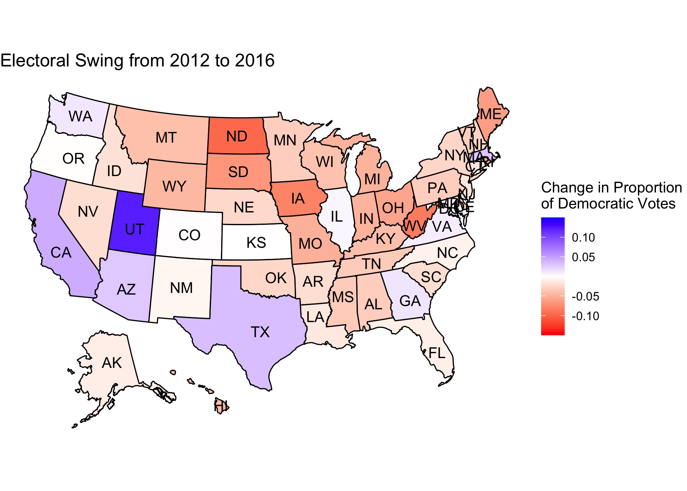

# Introduction: Past Presidential Election Results
## September 11, 2020

The US Electoral College system places a great importance on "swing states." However, the notion of electoral swing takes on several definitions, varying by context. For example, the label of "swing state" could indicate volatility between elections, such that it "swings" in one direction or another. Conversely, a "swing state" could also consistently post close races within a state that could *swing* either way. 

For the purpose of this analysis, electoral "swing" captures the magnitude of the change in a particular party's vote share between elections. In this case, a larger quantity indicates a larger swing.

For the past couple of decades, most states consistently voted either red or blue. However, Donald Trump flipped many reliably blue states to red in his 2016 victory, and, in the words of [Politico](https://www.politico.com/news/magazine/2020/02/07/election-2020-new-electoral-map-110496), "blew up" the Electoral Map. The below graphic displays shifts in the two-party vote across the country between the 2012 and 2016 presidential elections: 

Positive values indicate blue-trending states, while negative values indicated red-trending states. In the above map, there are far more red-trending states than blue, indicating that Republican vote share increased in the 2016 presidential race relative to the 2012 race, as expected given the outcome of the election.

With the 2020 election on the horizon, the possibility of electoral swing has become increasingly important. Research by [Gallup](https://news.gallup.com/poll/313079/mood-doesn-bright-incumbents-win.aspx) reveals that an incumbent can still win re-election in the face of low approval numbers, so a Democratic victory in 2020 requires enough red states from 2016 to swing blue. The [New York Times](https://www.nytimes.com/interactive/2020/us/elections/election-states-biden-trump.html) supports this notion that voters in a dozen competitive states will decide the 2020 presidential race.

To take a closer look at trends between 2012 and 2016, it is helpful to identify key *battleground* states that have swung in one direction or another. To begin, one must define 
*battleground state*. Generally, *battleground states* have a close race between the two competing parties. For the purpose of this analysis, I defined *battleground states* as those with vote shares between 45% and 55% in at least one of the 2012 and 2016 presidential elections. The plot displays these battleground states and their respective changes in two-party Democratic vote share (see [table](figures/swing_table.html) for full data):

Of the states that met the pre-defined *battleground* criteria, three out of four of the blue-trending battleground states voted Republican in both elections, with none of the blue-trending states flipping. Likewise, the vast majority of red-trending battleground states voted Democrat in 2012.

Texas exhibited the largest Democratic shift, followed by Arizona and Georgia. If the trends in these states continue over time, they could reasonably flip to blue in the next few election cycles. 

In the 2016 election, Florida, Pennsylvania, Wisconsin, Michigan, Ohio, and Iowa flipped from blue to red, with Iowa doing so by the largest margin. While Maine missed the mark to flip in 2016 by a narrow margin, the state could plausibly vote Republican in 2020 if the trend continues. In general, red-trending states saw shifts of a larger magnitude than blue-trending states:

Of course, the additional context of COVID-19, the resulting economic turmoil, and racial protests around the country add additional noise to the election not captured in the trends observed between 2012 and 2016. However, patterns of the past lay the groundwork for the future, and shifting ideological trends in states may prove worthwhile when anticipating the results in November.
