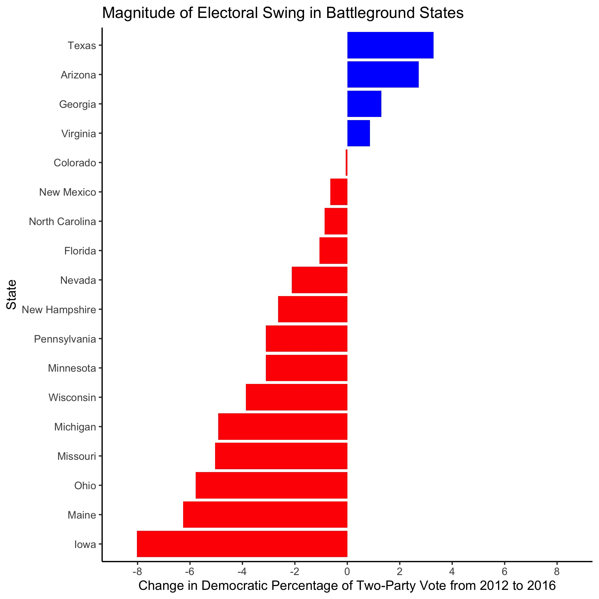

# Introduction: Past Presidential Election Results
## September 11, 2020

#### Defining Electoral Swing

During election season, political aficionados devote large amounts of attention to swing states. The US Electoral College system often places the election in the hands of voters in a select few states, often referred to as *swing states*. The notion of electoral swing takes on several definitions that vary by context. For example, a state with electoral volatility experiences *swings* in voting patterns between elections. Conversely, a state that consistently posts close races could *swing* either way on Election Day. 

For the purpose of this analysis, electoral **swing** focuses on the magnitude of changes in vote share between elections. More specifically, this analysis quantifies electoral swing by the change in the Democratic share of the two-party vote from 2012 to 2016:

```
swing_margin = dem_2016 / (dem_2016 + rep_2016) - dem_2012 / (dem_2012 + repub_2012)

```

By this definition, a state with a large swing may not have a close election. To address close elections, this analysis defines **battleground** states as those with two-party vote shares between 45% and 55% for one or both of the 2012 and 2016 presidential elections.

#### Swing States in Recent Years

For the past two decades, states followed similar voting patterns year over year. However, Donald Trump "[blew up](https://www.politico.com/news/magazine/2020/02/07/election-2020-new-electoral-map-110496)" the Electoral Map in his 2016 victory when he flipped many reliably blue states to red. Using data on the presidential popular vote by state from 1948 to 2016, the below graphic displays shifts in the two-party vote across the country between the 2012 and 2016 presidential elections: 


Positive values indicate blue-trending states, while negative values indicated red-trending states. In the above map, there are far more red-trending states than blue, indicating that Republican vote share increased in the 2016 presidential race relative to the 2012 race, as expected given the outcomes of the two elections.[^bignote]

To take a closer look at trends between 2012 and 2016, it is helpful to identify key battleground states that have swung in one direction or another. The plot below displays battleground states and their respective changes in two-party vote share (see this  [table](../figures/swing_table.html) for full data):


Of the states that met the pre-defined *battleground* criteria, three out of four of the blue-trending battleground states voted Republican in both elections, and none of the blue-trending states flipped parties. Texas exhibited the largest Democratic shift, followed by Arizona and Georgia. If the trends in these states continue over time, they could reasonably flip to blue in the next few election cycles. 

The vast majority of red-trending battleground states voted for Barack Obama in 2012. In the 2016 election, Florida, Pennsylvania, Wisconsin, Michigan, Ohio, and Iowa flipped from blue to red, with Iowa doing so by the largest margin. While Maine narrowly failed to flip to red in 2016, the state could plausibly vote Republican in 2020 if the trend continues. In general, red-trending states saw shifts of a larger magnitude than blue-trending states:



#### Looking Forward

With the 2020 election on the horizon, the possibility of electoral swing has become increasingly important. Research by [Gallup](https://news.gallup.com/poll/313079/mood-doesn-bright-incumbents-win.aspx) reveals that incumbents can still win re-election in the face of low approval numbers, so a Democratic victory in 2020 requires enough red states from 2016 to swing blue. This interactive tool by the [New York Times](https://www.nytimes.com/interactive/2020/us/elections/election-states-biden-trump.html) supports this notion that voters in a dozen competitive states will decide the 2020 presidential race.

Of course, the additional context of COVID-19, racial protests, and the resulting economic turmoil add additional noise not captured in the trends observed between 2012 and 2016. However, patterns of the past lay the groundwork for the future, and studying partisan shifts in states may prove worthwhile when anticipating the results in November.

[^bignote]: The magnitude of the Democratic shift in Utah likely owes itself to the individual candidates running for office in 2012 and 2016 rather than partisan shifts across the state. Approximately [69%](https://newsroom.churchofjesuschrist.org/facts-and-statistics/state/utah) of Utah's population identifies with the Church of Jesus Christ of Latter-Day Saints. Mitt Romney, a Mormon, ran as the Republican candidate in 2012 and likely energized this base of voters. Donald Trump still managed to win Utah in 2016, but he failed to receive a majority of votes as Evan McMullin, a Mormon conservative, received [21.5%](https://www.270towin.com/states/Utah) of the vote as a third-party candidate.
