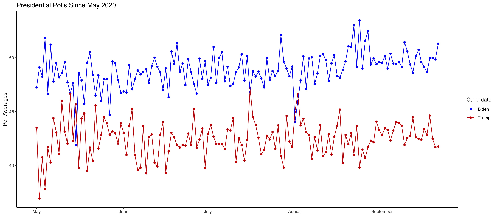
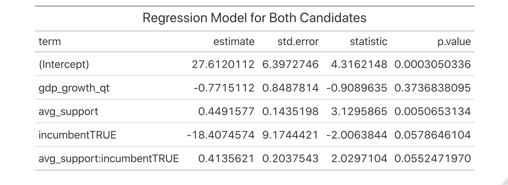

# Polling and Presidential Elections
## September 26, 2020

### Polls and Presidential Elections

Last week's blog post on the economy revealed that the economy tumult of 2020 makes a fundamentals-only predictions unrealistic for 2020. Polls generally serve as a valuable resource to gauge public opinion in elections, but the unusual circumstances of 2020 amplify this effect. Polls in the first half of election years often serve as [weak predictors](https://projects.economist.com/us-2020-forecast/president/how-this-works) for November outcomes, but polls ultimately converge to the election outcome as Election Day approaches. Political scientists theorize that this convergence of numbers occurs due to voters reaching their enlightened opinions[^Gelman-and-King], and a quick look at the polling numbers since May 2020, when Joe Biden became the presumptive Democratic nominee, confirm this notion as the numbers begin to stabilize in September:

### Building off of Economy Model 3

Following [last week](../posts/economy.md)'s lead, I began my quest to construct a model by improving upon [Model 3](../figures/economy/inc_q1_gdp_approval.html), a multivariate model predicting the incumbent party's two-party vote share from Q1 GDP growth, Q3 job approval numbers, incumbency status, and the interactions between incumbency and Q1 GDP growth and Q3 job approval numbers.

To improve the model, I replaced Q3 job approval numbers with presidential polling averages. This adjustment brought the adjusted r-squared to 0.966, meaning that the model fit the historical data strikingly well but put the model at risk for overfitting and poor out-of-sample performance. To amend this, I removed the interaction term between incumbency and Q1 GDP growth (but kept it for incumbency and average support), which lowered the adjusted r-squared to 0.910 but improved the out-of-sample fit. This new model successfully classified two-party popular vote victories in 84.6% of the post-WWII elections when performing leave-one-out cross validation.

Another issue with last week's model is that it predicted the two-party vote share for the *incumbent* party. While I could use this approach to estimate Trump's predicted vote share, it would not accurately estimate Biden's vote share since it was only fit with data from the incumbent party. To maintain a consistent approach when estimating the vote share for both candidates, I must fit a model with data from both parties. 

To construct a model for both candidates, I removed the incumbent party filter from last week's [Model 3](../figures/economy/inc_q1_gdp_approval.html), incorporated historical polling numbers in the place of Q3 job approval, and removed the interaction term between incumbency and Q1 GDP growth. Also, since the polling numbers do not add up to 100% since many voters were either undecided, I constructed this model to predict the overall popular vote share instead of the two-party popular vote:

This new model has an adjusted r-squared of 0.688 and correctly classified 76.9% of the past elections in a [leave-one-out cross validation](..figures/polling/both_model_classification.html). When put to the test with 2020 numbers for the respective candidates, the model predicted that Biden would win approximately **51.2%** of the popular vote and Trump would earn **47.6%** of the popular vote.

### Weighing 2020 Polls Based on 2016 Performance & Comparing to Lab

As mentioned in the introduction, polls generally serve as a helpful indicator for the electorate's positions on candidates, but some polls make better predictions than others. Five Thirty Eight has compiled data on [pollster ratings](https://github.com/fivethirtyeight/data/tree/master/pollster-ratings) that account for bias and error from various pollsters. Below, Figure 3 displays the sum of the absolute value of errors for Clinton and Trump's vote shares from September 2016 polls:

[Figure 3](../figures/polling/pollster_accuracy_sep2016.jpeg)

To supplement my regression model, I compiled another set of predictions by assigning weights[^weight-scheme] to September 2020 pollster numbers relative to their accuracy in September 2016. Applying greater weights to more accurate polls from September 2016 yields predicted vote shares of **50.7%** for Joe Biden and **42.7%** for Donald Trump.

This obviously leaves quite a bit of room for independent and undecided voters to fill in the gaps. I anticipate that more voters will stumble upon their "enlightened preferences"[^Gelman-and-King] as the election nears and the sum of the popular vote share from the two major parties will get closer to 100%.

### Combined Model

Drawing inspiration from this week's laboratory section, I sought out to combine the two predictions into a single method. I took the simple average of the weighted poll scheme with the above regression to get combined predictions of approximately **51.0%** of the overall popular vote for Biden and **45.2%** of the overall popular vote for Trump.

### Forecasters' Different Approaches

The models presented on this blog draw inspiration from but pale in comparison to forecasts from [FiveThirtyEight](https://fivethirtyeight.com/features/how-fivethirtyeights-2020-presidential-forecast-works-and-whats-different-because-of-covid-19/) and [The Economist](https://projects.economist.com/us-2020-forecast/president/how-this-works).

Both forecasts incorporate a mixture of polling and "fundamentals" in their models, with The Economist relying more heavily on fundamentals and FiveThirtyEight focusing relatively more attention on polling. Nate Silver of FiveThirtyEight justifies this approach in stating that the small sample size of overall elections makes economic models challenging. Not only that, but he also cites the noisy relationship between economic conditions and the incumbent's party performance as a cause for caution. The Economist aims to avoid overfitting and combat other issues typical of fundamentals-forward models through methods such as elastic net regularization and leave-one-out cross-validation.

In addition to balancing between fundamentals and polls, both models also adjust for state partisan lean, run thousands of simulations to anticipate possible outcomes, adjust polling and economic numbers, and attempt to account for uncertainty. FiveThirtyEight does a clearer job of outlining specific approaches tailored toward the unique circumstances of COVID-19, but The Economist may have decided to not include a section on that since this is their first presidential forecast of the sort, COVID or not.

FiveThirtyEight clearly has more historical experience in forecasting elections, and I feel that it has a better approach for forecasting the 2020 election. Nate Silver clearly outlines the reasoning behind COVID-19 adjustments in his model, and the lower dependence on economic indicators seems more fitting for the unusual economic circumstances of 2020.

[^Gelman-and-King]: [Gelman and King, 1993] Gelman, A. and King, G. (1993).Why are American presidential election campaign polls so variable when votes are so predictable? British Journal of Political Science, 23(4):409–451.

[^weight-scheme]: In my approach weigh polls proportionately to their accuracy in predicting the 2016 election, I first summed the absolute value of errors for all off of the polls and then calculated each poll's proportion of that error. Polls with smaller proportions more closely resembled with 2016 outcome. In order to ascribe greater weight to more accurate polls, I took the inverse of each proportion and then divided by 296.8874 so that the weights would sum to 1. 

