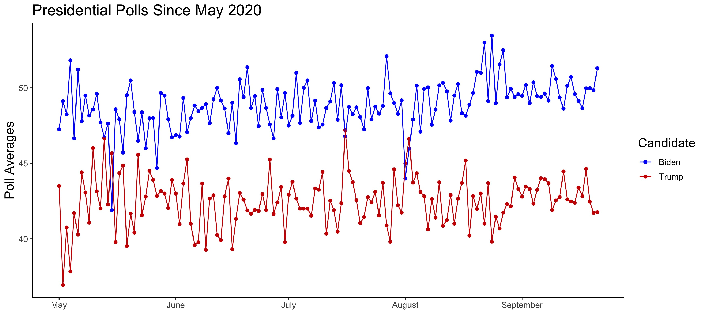

# Polling and Presidential Elections
## September 26, 2020

### Polls and Presidential Elections

Last week's blog post on the economy revealed that the economy tumult of 2020 makes a fundamentals-only predictions unrealistic for 2020. Polls generally serve as a valuable resource to gauge public opinion in elections, but the unusual circumstances of 2020 amplify this effect. Polls in the first half of election years often serve as [weak predictors](https://projects.economist.com/us-2020-forecast/president/how-this-works) for November outcomes, but polls ultimately converge to the election outcome as Election Day approaches. Political scientists theorize that this convergence of numbers occurs due to voters reaching their enlightened opinions[^Gelman-and-King], and a quick look at the polling numbers since May 2020, when Joe Biden became the presumptive Democratic nominee, confirm this notion as the numbers begin to stabilize in September:

### Building on Economy Model

Following last week's lead, I began my quest to construct a model by improving upon [Model 3](../figures/economy/inc_q1_gdp_approval.html), a multivariate model predicting the incumbent party's two-party vote share from Q1 GDP growth, Q3 job approval numbers, incumbency status, and the interactions between incumbency and Q1 GDP growth and Q3 job approval numbers.

### Weighing 2020 Polls Based on 2016 Performance & Comparing to Lab

(1) How much variation is there in pollster quality? (2) Using tools and knowledge you’ve gained so far, build a model (possibly an ensemble) using individual polls from 2016 (poll_2016.csv) and 2020 (poll_2020.csv). How does your model compare to the models this week in lab?

Not all polls are treated equally.

### Predictions

### Forecasters' Different Approaches

What Do Forecasters Do? Based on what you’ve learned about fundamentals and poll-based forecasts, (1) briefly summarize Silver (2020) and Morris (2020a) and (2) compare and contrast their approaches. In your opinion, which of the two is the better approach?

[^Gelman-and-King]: [Gelman and King, 1993] Gelman, A. and King, G. (1993).Why are American presidentialelection campaign polls so variable when votes are so predictable?British Journal ofPolitical Science, 23(4):409–451.

