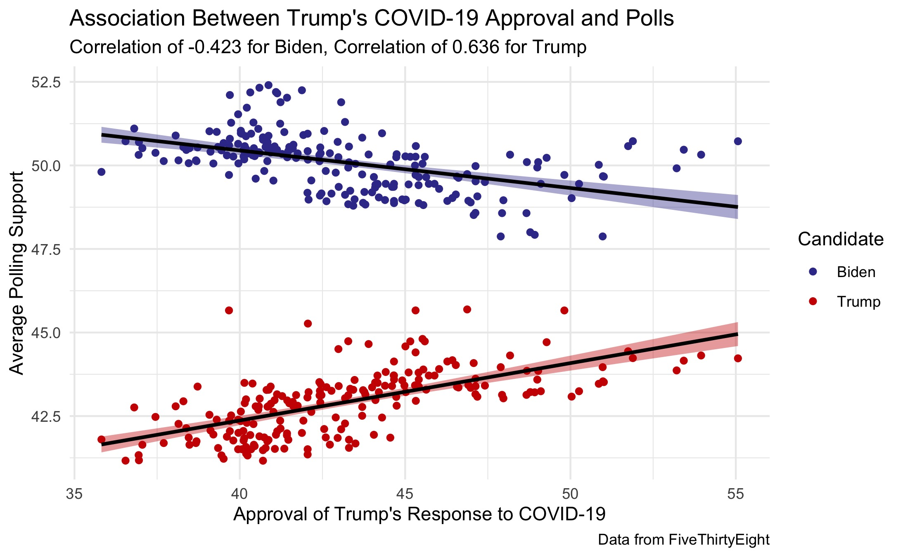

# Shocks and Elections: COVID-19
## October 24, 2020

### What the Literature Says about Shocks

The media loves a good "October Surprise," and 2020 has had its fair share of big events. COVID-19 steadily remains the defining issue of the 2020 election, in spite of scandals ranging from [tax avoidance](https://www.nytimes.com/interactive/2020/09/27/us/donald-trump-taxes.html) by the president, [misleading the public](https://www.nytimes.com/2020/09/09/us/politics/woodward-trump-book-virus.html) on the state of COVID-19, and accusations of suspicious [emails](https://www.vox.com/2020/10/14/21515776/hunter-biden-emails-giuliani). How will shocks such as COVID-19 translate into electoral outcomes?

It certainly sounds interesting to think that shark attacks[^achen] led to Woodrow Wilson's defeat in the 1916 election, but most sensational headlines come from flawed statistics.[^fowler] Such voter behavior seems irrational, but studies on tornadoes[^healy] reveal that voters respond to economic damage resulting from the tornadoes rather than death counts. With this considers, it appears that voters response to how the incumbent *handles* such shocks rather than blaming the incumbent for the occurrence of the events.

### The Impact of COVID-19 on the 2020 Election

The [economic numbers](economy.md) of 2020 reflect the damage of COVID; incorporating economic data into prediction models picks up on some of the 2020 shocks. However, voters' emotional responses to certain events of 2020 may exist independent of economic circumstances. In this situation, polls should pick up any sort of non-economic reaction by the public. Examining COVID-19 metrics, for example, shows that deaths and positive test counts have fairly strong, negative correlations with Donald Trump's approval ratings:[^metrics]

Not surprisingly, public opinion about Donald Trump's handling of the COVID-19 crisis has a moderately strong, positive correlation with his overall polling numbers and the inverse if true for Biden's poll numbers and Trump's COVID approval:

Since COVID metrics and COVID-specific approval is correlated with metrics already included in my models, incorporating these additional variables into a model would be redundant. Rather, polls and economic metrics can serve as a proxy for impact of the shocks of 2020 on the electorate.

### Modeling with Economic Numbers and Polls, by State

[Last week's model](turnout.md) was admittedly weak, but a few minor tweaks strengthened the model significantly. As I mentioned, fitting a separate model for each state left each model extremely susceptible to overfitting and poor out-of-sample performance. To fix this, I made these changes:

* I fit separate models for 3 different categories of states: strong or likely blue states, strong or likely red states, and battleground states,[^categories] with the thinking that these states exhibit similar behavior surrounding elections. With this method, I used each state as an individual observation of election outcomes, which substantially increased the sample size of the data when constructing the model.
* I cut out several of the predictors from the previous week, making the model much more parsimonious. This time, the model predicts the voter turnout for each party using state polling numbers from 2 weeks out, incumbency status, the interaction between incumbency and polls, Q1 GDP growth, that state's Democratic popular vote margin in the previous election, and the change in that state's Black population.

I maintained the underlying binomial logistic model and varied the turnout as I did before. This method yielded much closer and more reasonable predictions for every state:

| Candidate | Electoral Votes | Two-Party Popular Vote |
|-----------|-----------------|------------------------|
| Biden     | 350[^DC]        | 0.528                  |
| Trump     | 214             | 0.423                  |

The above map shows the win margin and displays how close each race is in each state, but [this map](../figures/shocks/winner_map.jpg) clearly displays the predicted winner for each state and [this table](../figures/shocks/state_pv_table.html) shows the predicted two-party popular votes for each state.

### Looking Ahead

With less than two weeks remaining until Election Day, my next post will be my final election prediction. I will likely make some tweaks to the model in this post and include the updated polling numbers. For this post, I used the model to make a preliminary prediction as part of the discussion about how the polling numbers and economic data fit into COVID-19. Next week's post will go into further depth about my reasoning behind constructing the model, its strength and external validity, and uncertainty surrounding the prediction.

[^achen]: [Achen and Bartels, 2017] Achen, C. H. and Bartels, L. M. (2017). Democracy for realists: Why elections do not produce responsive government, volume 4. Princeton University

[^fowler]: [Fowler and Hall, 2018] Fowler, A. and Hall, A. B. (2018). Do Shark Attacks Influence Presidential Elections? Reassessing a Prominent Finding on Voter Competence. The Journal of Politics, 80(4):1423–1437.

[^healy]: [Healy et al., 2010] Healy, A., Malhotra, N., et al. (2010). Random events, economic losses, and retrospective voting: Implications for democratic competence.Quarterly Journal of Political Science, 5(2):193–208.

[^metrics]: It is important to note that the deaths plot shows the absolute count of deaths in the United States, which increase day-by-day. Plotting the number of deaths on the x-axis essentially shows how the poll numbers have traveled over time. In this case, the death count in March looks quite different from the death count in August, even if COVID-19 is relatively more tame in the latter. In contrast, the increase in the number of positive tests is a more relative number that varies each day but you can observe similar counts months apart. The strong negative correlation between the increase in positive test results and Trump's poll numbers shows that the polls are associated with the increase in positive results, which serve as a proxy for the severity of the pandemic, rather than serving as a simple function of time. 

[^categories]: I followed the [New York Time's classification](https://www.nytimes.com/interactive/2020/us/elections/election-states-biden-trump.html) of states when selecting which states to include in each model.

[^DC]: The model did not include DC, but I added it to the electoral count since it consistently votes blue in presidential elections.

