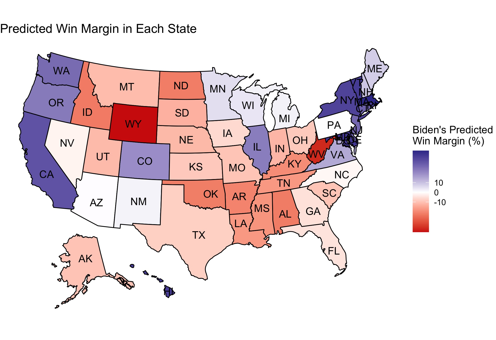

# Shocks and Elections: COVID-19
## October 24, 2020

### What the Literature Says about Shocks

The media loves a good "October Surprise," but how do shocks actually translate into electoral outcomes? Did the opening of the investigation into Clinton's emails cause the 2016 Democratic contender to lose the race? How did Trump manage to win the office after the release of the Access Hollywood tape? While there have been personal scandals in the 2020 race (Bob Woodward, taxes), COVID-19 reigns as the defining issue of this year.

It certainly sounds interesting to think that shark attacks[^achen] led to Woodrow Wilson's defeat in the 1916 election, but most sensational headlines come from flawed statistics.[^fowler] Such voter behavior seems irrational, but studies on tornadoes[^healy] reveal that voters respond to economic damage resulting from the tornados rather than death counts. With this considers, it appears that voters response to how the incumbent *handles* such shocks rather than blaming the incumbent for the occurrence of the events. How does this translate to COVID-19 and the 2020 presidential election?

### The Impact of COVID-19 on the 2020 Election

The [economic numbers](economy.md) of 2020 undoubtedly reflect COVID-19's damage, so incorporating economic data in models helps pick up on some of the 2020 shocks. However, voters' emotional responses to COVID and other events of 2020 may be independent of economic circumstances. Polls should pick up any sort of non-economic reaction to the circumstances. Taking COVID-19 metrics, for example, shows that deaths and positive test counts have fairly strong, negative correlations with Donald Trump's approval ratings:[^metrics]

|              |  avg_support   |    death | deathIncrease |   positive |positiveIncrease |
| -------------|----------------|-----------|--------------|------------|-----------------|            
|avg_support    |   1.00000000 |-0.64782421  | -0.06447719 |-0.51258921  |     -0.8083311 |

Not surprisingly, public opinion about Donald Trump's handling of the COVID-19 crisis and his overall polling numbers also appear to have a moderate, negative correlation:

These correlations reveal that incorporating additional variables into a model to reflect COVID-19 might be redundant. Rather, polls and economic metrics can serve as a proxy for impact of the shocks of 2020 on the electorate.

### Modeling with Economic Numbers and Polls, by State

[Last week's model](turnout.md) was admittedly weak, but a few minor tweaks strengthened the model significantly. As I mentioned, fitting a separate model for each state left each model extremely susceptible to overfitting and poor out-of-sample performance. To fix this, I made these changes:

* I fit models for 3 different categories of states: strong blue states, strong red states, and battleground states,[^categories] rather than a model for all 50 states
* I made the model much more parsimonious, using state polling numbers from 2 weeks out, incumbency status, the interaction between incumbency and polls, Q1 GDP growth, that state's Democratic popular vote margin in the previous election, and the change in that state's Black population.

I maintained the underlying binomial logistic model and varied the turnout as I did before. This method yielded must closer and more reasonable predictions for every state:

| Candidate | Electoral Votes | Two-Party Popular Vote |
|-----------|-----------------|------------------------|
| Biden     | 350[^DC]        | 0.528                  |
| Trump     | 214             | 0.423                  |

This above map shows the win margin and displays how close each race is in each state, but [this](../figures/shocks/winner_map.jpg) map clearly shows the predicted winner for each state.

### Looking Ahead

- 2 weeks left!
- Next post will be final model
- Hope to tweak this existing model, go further in depth about confidence, strength, out-of-sample and in-sample fit, etc. (check final prediction rubric)
- Will run model with updated poll numbers on top of any other changes

[^achen]: [Achen and Bartels, 2017] Achen, C. H. and Bartels, L. M. (2017). Democracy for realists: Why elections do not produce responsive government, volume 4. Princeton University

[^fowler]: [Fowler and Hall, 2018] Fowler, A. and Hall, A. B. (2018). Do Shark Attacks Influence Presidential Elections? Reassessing a Prominent Finding on Voter Competence. The Journal of Politics, 80(4):1423–1437.

[^healy]: [Healy et al., 2010] Healy, A., Malhotra, N., et al. (2010). Random events, economic losses, and retrospective voting: Implications for democratic competence.Quarterly Journal of Political Science, 5(2):193–208.

[^metrics]: It is important to note that the deaths plot shows the absolute count of deaths in the United States, which increase day-by-day. Plotting the number of deaths on the x-axis essentially shows how the poll numbers have traveled over time. In this case, the death count in March looks quite different from the death count in August, even if COVID-19 is relatively more tame in the latter. In contrast, the increase in the number of positive tests is a more relative number that varies each day but you can observe similar counts months apart. The strong negative correlation between the increase in positive test results and Trump's poll numbers shows that the polls are associated with the increase in positive results, which serve as a proxy for the severity of the pandemic, rather than serving as a simple function of time. 

[^categories]: I followed the [New York Time's classification](https://www.nytimes.com/interactive/2020/us/elections/election-states-biden-trump.html) of states when selecting which states to include in each model.

[^DC]: The model did not include DC, but I added it to the electoral count since it consistently votes blue in presidential elections.

