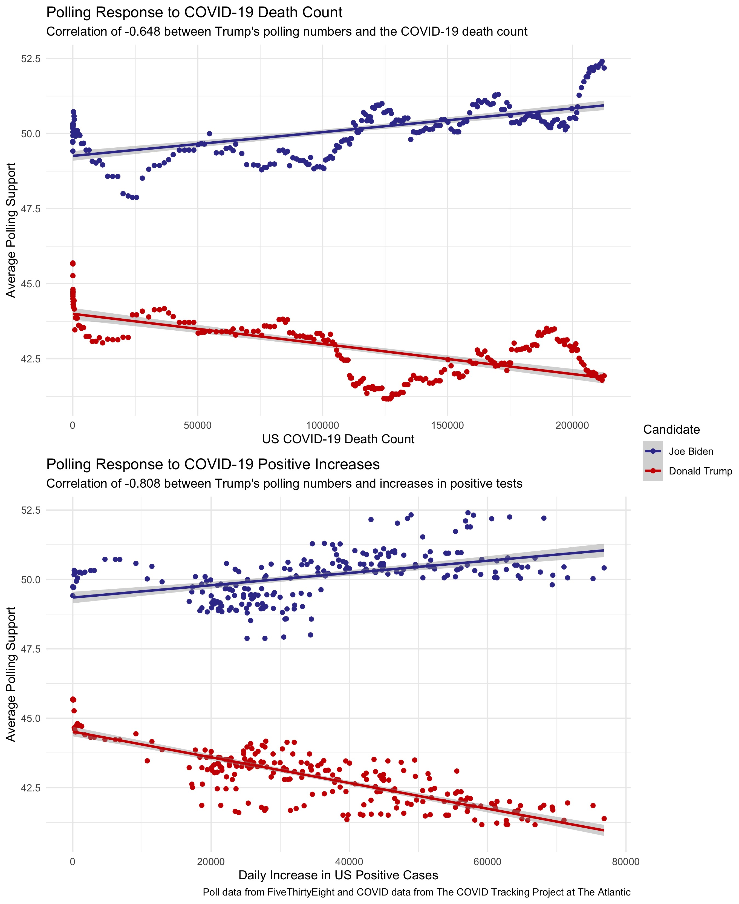

# Shocks and Elections: COVID-19
## October 24, 2020

### What the Literature Says about Shocks
- tornadoes only with economic damage
- irrationality in shark attacks have largely been disproven
- even if voters were behaving irrationally, polls should capture that

### The Impact of COVID-19 on the 2020 Election

The [economic numbers](economy.md) of 2020 undoubtedly reflect COVID-19's damage, so incorporating economic data in models helps pick up on some of the 2020 shocks. However, voters' emotional responses to COVID and other events of 2020 may be independent of economic circumstances. Polls should pick up any sort of non-economic reaction to the circumstances. Taking COVID-19 metrics, for example, shows that deaths and positive test counts have fairly strong, negative correlations with Donald Trump's approval ratings:

|              |  avg_support   |    death | deathIncrease |   positive |positiveIncrease |
| -------------|----------------|-----------|--------------|------------|-----------------|            
|avg_support    |   1.00000000 |-0.64782421  | -0.06447719 |-0.51258921  |     -0.8083311 |

These correlations reveal that incorporating additional variables into a model to reflect COVID-19 might be redundant. Rather, polls and economic metrics can serve as a proxy for impact of the shocks of 2020 on the electorate.

### Modeling with Economic Numbers and Polls, by State

[Last week's model](turnout.md) was admittedly weak, but a few minor tweaks strengthened the model significantly. As I mentioned, fitting a separate model for each state left each model extremely susceptible to overfitting and poor out-of-sample performance. To fix this, I made these changes:

* I fit models for 3 different categories of states: strong blue states, strong red states, and battleground states,[^categories] rather than a model for all 50 states
* I made the model much more parsimonious, using state polling numbers from 2 weeks out, incumbency status, the interaction between incumbency and polls, Q1 GDP growth, that state's Democratic popular vote margin in the previous election, and the change in that state's Black population.

I maintained the underlying binomial logistic model and varied the turnout as I did before. This method yielded must closer and more reasonable predictions for every state:

| Candidate | Electoral Votes | Two-Party Popular Vote |
|-----------|-----------------|------------------------|
| Biden     | 350[^DC]        | 0.528                  |
| Trump     | 214             | 0.423                  |

### Looking Ahead

- 2 weeks left!
- Next post will be final model
- Hope to tweak this existing model, go further in depth about confidence, strength, out-of-sample and in-sample fit, etc. (check final prediction rubric)
- Will run model with updated poll numbers on top of any other changes

[^categories]: I followed the [New York Time's classification](https://www.nytimes.com/interactive/2020/us/elections/election-states-biden-trump.html) of states when selecting which states to include in each model.

[^DC]: The model did not include DC, but I added it to the electoral count since it consistently votes blue in presidential elections.

